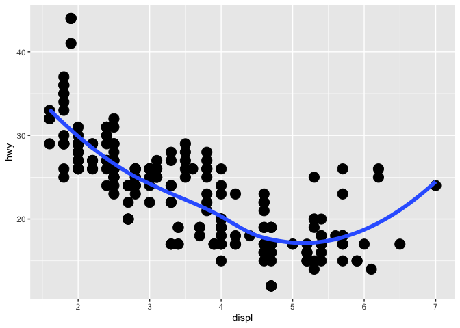

###Chapter 1: Intro
- tidying:storing data in a consister form that reflects the semantics of the data set
- transforming:includes narrowing in on observations, creating new variables from existing ones, and calculating summary statistics


```r
library("tidyverse")
```

```
## ── Attaching packages ───────────────────────────────────────────────────────────────── tidyverse 1.2.1 ──
```

```
## ✔ ggplot2 3.2.0     ✔ purrr   0.3.2
## ✔ tibble  2.1.3     ✔ dplyr   0.8.1
## ✔ tidyr   0.8.3     ✔ stringr 1.4.0
## ✔ readr   1.3.1     ✔ forcats 0.4.0
```

```
## Warning: package 'ggplot2' was built under R version 3.5.2
```

```
## Warning: package 'tibble' was built under R version 3.5.2
```

```
## Warning: package 'tidyr' was built under R version 3.5.2
```

```
## Warning: package 'purrr' was built under R version 3.5.2
```

```
## Warning: package 'dplyr' was built under R version 3.5.2
```

```
## Warning: package 'stringr' was built under R version 3.5.2
```

```
## Warning: package 'forcats' was built under R version 3.5.2
```

```
## ── Conflicts ──────────────────────────────────────────────────────────────────── tidyverse_conflicts() ──
## ✖ dplyr::filter() masks stats::filter()
## ✖ dplyr::lag()    masks stats::lag()
```

###Chapter 3: Data visualization
####3.1: Introduction
- ggplot2:implements the grammar of graphics, a system for describing and building graphs
####3.2: First Steps
Creating a ggplot

```r
ggplot(data = mpg) + 
  geom_point(mapping = aes(x = displ, y = hwy))
```

<!-- -->
- ggplot() creates a coordinated system for you to add layers to.
- geompoint() adds the layer of points or the scatter plot
A graphing template
  ggplot(data = <DATA>) + 
   <GEOM_FUNCTION>(mapping = aes(<MAPPING>))
Exercises (Assigned Problem set #1)
1. Run ggplot(data = mpg). What do you see?

```r
ggplot(data = mpg)
```

<!-- -->
- When you run ggplot(data=mpg), you get a blank graph.
2. How many rows are in mpg? How many columns?

```r
mpg
```

```
## # A tibble: 234 x 11
##    manufacturer model displ  year   cyl trans drv     cty   hwy fl    class
##    <chr>        <chr> <dbl> <int> <int> <chr> <chr> <int> <int> <chr> <chr>
##  1 audi         a4      1.8  1999     4 auto… f        18    29 p     comp…
##  2 audi         a4      1.8  1999     4 manu… f        21    29 p     comp…
##  3 audi         a4      2    2008     4 manu… f        20    31 p     comp…
##  4 audi         a4      2    2008     4 auto… f        21    30 p     comp…
##  5 audi         a4      2.8  1999     6 auto… f        16    26 p     comp…
##  6 audi         a4      2.8  1999     6 manu… f        18    26 p     comp…
##  7 audi         a4      3.1  2008     6 auto… f        18    27 p     comp…
##  8 audi         a4 q…   1.8  1999     4 manu… 4        18    26 p     comp…
##  9 audi         a4 q…   1.8  1999     4 auto… 4        16    25 p     comp…
## 10 audi         a4 q…   2    2008     4 manu… 4        20    28 p     comp…
## # … with 224 more rows
```
- 234 rows, 11 columns
3. What does the drv variable describe? Read the help for ?mpg to find out.

```r
?mpg
```
- drv describes whether or not the car is front-wheel drive, rear wheel drive or 4wd.
4. Make a scatterplot of hwy vs cyl

```r
ggplot(data = mpg) + 
  geom_point(mapping = aes(x = hwy, y = cyl))
```

<!-- -->
5. What happens if you make a scatterplot of class vs drv? Why is the plot not useful?

```r
ggplot(data = mpg) + 
  geom_point(mapping = aes(x = class, y = drv))
```

<!-- -->
- There is no numerical data, so we are unable to find a trend or add a numerical analysis to this data.
####3.3: Aesthetic Mapping
- you can add a third variable, like class, to a 2 variable plot by mapping it to an aesthetic 
- an aesthetic is a visual property of the object in your plot (shape, color, size)

```r
ggplot(data = mpg) + 
  geom_point(mapping = aes(x = displ, y = hwy, color = class))
```

<!-- -->
- this is an example of mapping color to class; to map an aesthetic to a variable, associate the name of the aesthetic to the name of the variable in aes().
- Mapping size to class:

```r
ggplot(data = mpg) + 
  geom_point(mapping = aes(x = displ, y = hwy, size = class))
```

```
## Warning: Using size for a discrete variable is not advised.
```

<!-- -->
- Mapping aesthetic alpha to class:

```r
ggplot(data = mpg) + 
  geom_point(mapping = aes(x = displ, y = hwy, alpha = class))
```

```
## Warning: Using alpha for a discrete variable is not advised.
```

<!-- -->
- Mapping shape to class:

```r
ggplot(data = mpg) + 
  geom_point(mapping = aes(x = displ, y = hwy, shape = class))
```

```
## Warning: The shape palette can deal with a maximum of 6 discrete values
## because more than 6 becomes difficult to discriminate; you have 7.
## Consider specifying shapes manually if you must have them.
```

```
## Warning: Removed 62 rows containing missing values (geom_point).
```

<!-- -->
- You can also set the aesthetics of your geom manually

```r
ggplot(data = mpg) + 
  geom_point(mapping = aes(x = displ, y = hwy), color = "blue")
```

<!-- -->
- How to use aes() to set aesthetics
  - for color: name of color as a character string
  - for size: size of a point in mm
  - for shape: the shape of the point as a number (the table correlating number to shape is in textbook)
Exercises (Assigned problem set #2)
1. What’s gone wrong with this code? Why are the points not blue?
ggplot(data = mpg) + 
  geom_point(mapping = aes(x = displ, y = hwy, color = "blue"))
- The point aren't blue, because color = "blue" is within the aes(). The code should be:
  geom_point(mapping = aes(x = displ, y = hwy), color = "blue") 
2. Which variables in mpg are categorical? Which variables are continuous? (Hint: type ?mpg to read the documentation for the dataset). How can you see this information when you run mpg?
- Categorical: Manufacturer, model, trans, drv, fl, class
- Continuous: hwy, cty, cyl, year, displ
- It's displayed in a data frame/ data table
3. Map a continuous variable to color, size, and shape. How do these aesthetics behave differently for categorical vs. continuous variables?
- Color

```r
ggplot(data = mpg) + 
  geom_point(mapping = aes(x = displ, y = hwy, color = cyl))
```

<!-- -->
- Size

```r
ggplot(data = mpg) + 
  geom_point(mapping = aes(x = displ, y = hwy, size = cyl))
```

<!-- -->
- For continuous variables, a gradient is established for size and color, rather than the random unique colors/sizes associted with categorical variables. Continuous variables can't be mapped to shape.
4. What happens if you map the same variable to multiple aesthetics?

```r
ggplot(data = mpg) + 
  geom_point(mapping = aes(x = displ, y = hwy, size = cyl, color = cyl))
```

<!-- -->
- It appears to map both aesthetics with both aesthetics behaving how they normally would.
5. What does the stroke aesthetic do? What shapes does it work with? (Hint: use ?geom_point)

```r
?geom_point()
```

```r
ggplot(data = mpg) + 
  geom_point(mapping = aes(x = displ, y = hwy), shape = 21, color = "purple", fill = "white", stroke = 1.4)
```

<!-- -->
- Strike changes the size of the border around the point. 
6. What happens if you map an aesthetic to something other than a variable name, like aes(colour = displ < 5)? Note, you’ll also need to specify x and y.

```r
ggplot(data = mpg) + 
  geom_point(mapping = aes(x = displ, y = hwy, color= displ<5))
```

<!-- -->
- It assigns the aesthetic to a logical statement. True is one color, while false is another.
####3.4: Common Problems
- the + sign has to come at the end of the first line, not the end of the second
- also carefully read the error message for hints on how to fix your code
####3.5: Facets
- another way to add additional variables to your plot, specifically categorical is facets
- facets split your data into multiple subplots that displays subsets of the data
How to facet your plot by a single variable (use of facet_wrap)

```r
ggplot(data = mpg) + 
  geom_point(mapping = aes(x = displ, y = hwy)) + 
  facet_wrap(~ class, nrow = 2)
```

<!-- -->
How to facet your plot on the combination of 2 variables (use of facet_grid)

```r
ggplot(data = mpg) + 
  geom_point(mapping = aes(x = displ, y = hwy)) + 
  facet_grid(drv ~ cyl)
```

<!-- -->
Exercises (Assigned Problem set #3)
1. What happens if you facet on a continuous variable?

```r
ggplot(data = mpg) + 
  geom_point(mapping = aes(x = displ, y = hwy)) + 
  facet_wrap(~ cyl, nrow = 2)
```

<!-- -->
- the subsets of the data that make up the subplots correlate to incremental changes in the continuous variable that the data set is faceted on.
2. What do the empty cells in plot with facet_grid(drv ~ cyl) mean? How do they relate to this plot?

```r
ggplot(data = mpg) + 
  geom_point(mapping = aes(x = drv, y = cyl)) + 
  facet_grid(drv ~ cyl)
```

<!-- -->
2. What plots does the following code make? What does . do?

```r
ggplot(data = mpg) + 
  geom_point(mapping = aes(x = displ, y = hwy)) +
  facet_grid(drv ~ .)
```

<!-- -->

```r
ggplot(data = mpg) + 
  geom_point(mapping = aes(x = displ, y = hwy)) +
  facet_grid(. ~ cyl)
```

<!-- -->
- Essentially, you are faceting on a single variable, but instead of the format yielded by facet_wrap(), you are able to maintain the columns/rows yield by facet_grid(). The . is used as a placeholder. When it is placed first (.~category), the function yields no rows and columns based on the category. When it is placed second (cateorgy~.), the function yields rows based on the catgeory and no columns.

4. What are the advantages to using faceting instead of the colour aesthetic? What are the disadvantages? How might the balance change if you had a larger dataset? 

```r
ggplot(data = mpg) + 
  geom_point(mapping = aes(x = displ, y = hwy)) + 
  facet_wrap(~ class, nrow = 2)
```

<!-- -->
- The advatages of faceting the data rather than using the color aesthetic is that the header clearly states the subset, as compared to looking at a key to see what subset is assigned to the color of the point. Faceting is also great for understanding trends within a subset. The disadvantages are that the color aesthetic allows you to compare different subsets side by side, while faceting splits up your data. The color aesthetic is also more interesting to look at then the faceted plots.
5. Read ?facet_wrap. What does nrow do? What does ncol do? What other options control the layout of the individual panels? Why doesn’t facet_grid() have nrow and ncol arguments?

```r
  ?facet_wrap()
```
- nrow and ncol set the number of rows and columns in the data set. scales and shrink also affect layout of the individual panels. facet_grid() dont have nrow and ncolum arguments because the number of rows/columns is determined by the variable(s) used in the facet_grid() function.
6. When using facet_grid() you should usually put the variable with more unique levels in the columns. Why?
- Truthfully, I have no idea. I'm assuming because it's more aesthetically pleasing or easy to read. 
####3.6: Geometric objects
- the geom function you use can change the shape/presentation of the data
- How to use geom_smooth() function

```r
ggplot(data = mpg) + 
  geom_smooth(mapping = aes(x = displ, y = hwy))
```

```
## `geom_smooth()` using method = 'loess' and formula 'y ~ x'
```

<!-- -->
- However, not every aesthetic works with every geom. You can't change the shape of the line, but you can change the type of line

```r
ggplot(data = mpg) + 
  geom_smooth(mapping = aes(x = displ, y = hwy, linetype = drv))
```

```
## `geom_smooth()` using method = 'loess' and formula 'y ~ x'
```

<!-- -->
Group aesthetics 

```r
ggplot(data = mpg) +
  geom_smooth(
    mapping = aes(x = displ, y = hwy, color = drv),
    show.legend = FALSE
  )
```

```
## `geom_smooth()` using method = 'loess' and formula 'y ~ x'
```

<!-- -->
How to display multiple geoms

```r
ggplot(data = mpg) + 
  geom_point(mapping = aes(x = displ, y = hwy)) +
  geom_smooth(mapping = aes(x = displ, y = hwy))
```

```
## `geom_smooth()` using method = 'loess' and formula 'y ~ x'
```

<!-- -->
- This code yields the same plot as above while allowing you to add aesthetics and adjust the geoms:
ggplot(data = mpg, mapping = aes(x = displ, y = hwy)) + 
  geom_point() + 
  geom_smooth()
Adding aesthetics/ filters

```r
ggplot(data = mpg, mapping = aes(x = displ, y = hwy)) + 
  geom_point(mapping = aes(color = class)) + 
  geom_smooth(data = filter(mpg, class == "subcompact"), se = FALSE)
```

```
## `geom_smooth()` using method = 'loess' and formula 'y ~ x'
```

<!-- -->
Exercises (Assigned Problem Set #4)
1. What geom would you use to draw a line chart? A boxplot? A histogram? An area chart?
- Line: geom_line, geom_smooth
- Boxplot: geom_boxplot
- Histogram: geom_histogram
- Area: geom_area
2. Run this code in your head and predict what the output will look like. Then, run the code in R and check your predictions.

```r
ggplot(data = mpg, mapping = aes(x = displ, y = hwy, color = drv)) + 
  geom_point() + 
  geom_smooth(se = FALSE)
```

```
## `geom_smooth()` using method = 'loess' and formula 'y ~ x'
```

<!-- -->
- I expected the plot to look like this, but I was unsure if the se = FALSE would effect the final outcome. I don't think it did?
3. What does show.legend = FALSE do? What happens if you remove it? Why do you think I used it earlier in the chapter?
- It affects whether or not aspects of the legend are shown.
4. What does the se argument to geom_smooth() do?
- se is related to the shading area that surrounds the lines. se = FALSE removes the shaded region.
5. Will these two graphs look different? Why/why not?
ggplot(data = mpg, mapping = aes(x = displ, y = hwy)) + 
  geom_point() + 
  geom_smooth()
ggplot() + 
  geom_point(data = mpg, mapping = aes(x = displ, y = hwy)) + 
  geom_smooth(data = mpg, mapping = aes(x = displ, y = hwy))
- They shouldn't be differences between the two graphs. Since the mappings for geom_point and geom_smooth are identical, placing mapping in ggplot should yield the same result as the ggplot will consider it a global mapping and apply it to both geom_point and geom_smooth. 
6. Recreate one of the graphs (I chose the 1st one)

```r
ggplot(data = mpg, mapping = aes(x = displ, y = hwy) ) + 
  geom_point(size = 5) +
  geom_smooth(size = 2, se=FALSE)
```

```
## `geom_smooth()` using method = 'loess' and formula 'y ~ x'
```

<!-- -->
####3.10 The layered grammar of graphics 
- This basic format can be used to make any plot I can imagine
ggplot(data = <DATA>) + 
  <GEOM_FUNCTION>(
     mapping = aes(<MAPPINGS>),
     stat = <STAT>, 
     position = <POSITION>
  ) +
  <COORDINATE_FUNCTION> +
  <FACET_FUNCTION>
