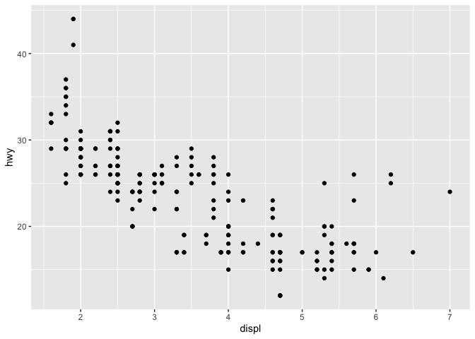

### Chapter 4: Workflow Basics
#### 4.1: Coding Basics
- using R as a calculator 

```r
(pi*32)/12
```

```
## [1] 8.37758
```
- you can create objects 

```r
x <- 3 *4
```

```r
x 
```

```
## [1] 12
```
- format creating objects take: my_object <- value
#### 4.2: What's in a name?
- object names must start with a letter and contain only letters, numbers, and _ and . 
- using tab can help you cycle through your variables
- in order to call/use a variable, you have to type it the exact same way it was entered
- my_rocks and my_Rocks will not yield the same result
#### 4.3: Calling Functions
- if you R shows you +, that means that R is expecting you to input more, usually you've forgotten a " or a )
#### 4.4: Practice (One of the assigned problem sets)
1. Why does this code not work?
my_variable <- 10
my_varıable
- The i character is not the same in both variables. In order to use a variable, you have to call it by typying it the exact same way it was entered
2. Tweak each of the following commands so they run correctly.
library(tidyverse)
ggplot(data = mpg) + 
  geom_point(mapping = aes(x = displ, y = hwy))
fliter(mpg, cyl = 8)
filter(diamond, carat > 3)
- Here are the correct versions:

```r
library("tidyverse")
```

```
## ── Attaching packages ───────────────────────────────────────────────────────────────── tidyverse 1.2.1 ──
```

```
## ✔ ggplot2 3.2.0     ✔ purrr   0.3.2
## ✔ tibble  2.1.3     ✔ dplyr   0.8.1
## ✔ tidyr   0.8.3     ✔ stringr 1.4.0
## ✔ readr   1.3.1     ✔ forcats 0.4.0
```

```
## Warning: package 'ggplot2' was built under R version 3.5.2
```

```
## Warning: package 'tibble' was built under R version 3.5.2
```

```
## Warning: package 'tidyr' was built under R version 3.5.2
```

```
## Warning: package 'purrr' was built under R version 3.5.2
```

```
## Warning: package 'dplyr' was built under R version 3.5.2
```

```
## Warning: package 'stringr' was built under R version 3.5.2
```

```
## Warning: package 'forcats' was built under R version 3.5.2
```

```
## ── Conflicts ──────────────────────────────────────────────────────────────────── tidyverse_conflicts() ──
## ✖ dplyr::filter() masks stats::filter()
## ✖ dplyr::lag()    masks stats::lag()
```

```r
ggplot(data = mpg) + 
  geom_point(mapping = aes(x = displ, y = hwy))
```

<!-- -->
- Nothing wrong with this piece of code

filter(mpg, cyl == 8) +
filter(diamond, carat > 3)

3. Press Alt + Shift + K. What happens? How can you get to the same place using the menus?
- I do not have an alt key, but when I push contrl + Shift + k it allows me to save and name the file. I can get to the same place by going to file and then clicking Save As.

### Chapter 5: Data Transformation
#### 5.1: Introduction

```r
library("tidyverse")
```

```r
library("nycflights13")
```
- types of variables  
    - int: integers
    - dbl: doubles or real numbers
    - chr: character vectors or strings
    - dttm: date+time
    - lgl: logical vector
    - fctr: factors, categorical values with fixed possible values
    - date: dates
- dplyr basics  
    - filter(): pick observations by their values
    - arrange(): reorder the rows
    - select(): pick variables by their name
    - mutate(): create new variables with functions of existing variables
    - summarize(): collapse many values into a single summary 
    - group_by(): changes scope of each function from entire dataset to group by group 

#### 5.2: Filter()

```r
jan1 <- filter(flights, month == 1, day == 1)
```

```r
jan1
```

```
## # A tibble: 842 x 19
##     year month   day dep_time sched_dep_time dep_delay arr_time
##    <int> <int> <int>    <int>          <int>     <dbl>    <int>
##  1  2013     1     1      517            515         2      830
##  2  2013     1     1      533            529         4      850
##  3  2013     1     1      542            540         2      923
##  4  2013     1     1      544            545        -1     1004
##  5  2013     1     1      554            600        -6      812
##  6  2013     1     1      554            558        -4      740
##  7  2013     1     1      555            600        -5      913
##  8  2013     1     1      557            600        -3      709
##  9  2013     1     1      557            600        -3      838
## 10  2013     1     1      558            600        -2      753
## # … with 832 more rows, and 12 more variables: sched_arr_time <int>,
## #   arr_delay <dbl>, carrier <chr>, flight <int>, tailnum <chr>,
## #   origin <chr>, dest <chr>, air_time <dbl>, distance <dbl>, hour <dbl>,
## #   minute <dbl>, time_hour <dttm>
```
- in order to save the modified data frame, assign it to a variable
- to filter correctly remember the comparison operators: >, <, >=, <=, ==, and !=
- make sure you use ==, not =
- = will result in an error
Logical operators
- filter() also uses Boolean operators such as &(and), |(or), !(not)

```r
filter(flights, month == 11 | month == 12)
```

```
## # A tibble: 55,403 x 19
##     year month   day dep_time sched_dep_time dep_delay arr_time
##    <int> <int> <int>    <int>          <int>     <dbl>    <int>
##  1  2013    11     1        5           2359         6      352
##  2  2013    11     1       35           2250       105      123
##  3  2013    11     1      455            500        -5      641
##  4  2013    11     1      539            545        -6      856
##  5  2013    11     1      542            545        -3      831
##  6  2013    11     1      549            600       -11      912
##  7  2013    11     1      550            600       -10      705
##  8  2013    11     1      554            600        -6      659
##  9  2013    11     1      554            600        -6      826
## 10  2013    11     1      554            600        -6      749
## # … with 55,393 more rows, and 12 more variables: sched_arr_time <int>,
## #   arr_delay <dbl>, carrier <chr>, flight <int>, tailnum <chr>,
## #   origin <chr>, dest <chr>, air_time <dbl>, distance <dbl>, hour <dbl>,
## #   minute <dbl>, time_hour <dttm>
```
- another way to write the above function uses x%in%y

```r
nov_dec <- filter(flights, month %in% c(11, 12))
```
- do not use && and || with filter()
Missing values
- if you wanna determine if a value is missing use: is.na()
- filter() only includes values that are true for the condition, leaving out false and NA
Practice (one of the assigned problem sets)
1.1. Had an arrival delay of two or more hours

```r
filter(flights, dep_delay >= 120 )
```

```
## # A tibble: 9,888 x 19
##     year month   day dep_time sched_dep_time dep_delay arr_time
##    <int> <int> <int>    <int>          <int>     <dbl>    <int>
##  1  2013     1     1      848           1835       853     1001
##  2  2013     1     1      957            733       144     1056
##  3  2013     1     1     1114            900       134     1447
##  4  2013     1     1     1540           1338       122     2020
##  5  2013     1     1     1815           1325       290     2120
##  6  2013     1     1     1842           1422       260     1958
##  7  2013     1     1     1856           1645       131     2212
##  8  2013     1     1     1934           1725       129     2126
##  9  2013     1     1     1938           1703       155     2109
## 10  2013     1     1     1942           1705       157     2124
## # … with 9,878 more rows, and 12 more variables: sched_arr_time <int>,
## #   arr_delay <dbl>, carrier <chr>, flight <int>, tailnum <chr>,
## #   origin <chr>, dest <chr>, air_time <dbl>, distance <dbl>, hour <dbl>,
## #   minute <dbl>, time_hour <dttm>
```
1.4. Departed in summer (July, August, and September)

```r
filter(flights, month == 8 | month == 7 | month == 9 )
```

```
## # A tibble: 86,326 x 19
##     year month   day dep_time sched_dep_time dep_delay arr_time
##    <int> <int> <int>    <int>          <int>     <dbl>    <int>
##  1  2013     7     1        1           2029       212      236
##  2  2013     7     1        2           2359         3      344
##  3  2013     7     1       29           2245       104      151
##  4  2013     7     1       43           2130       193      322
##  5  2013     7     1       44           2150       174      300
##  6  2013     7     1       46           2051       235      304
##  7  2013     7     1       48           2001       287      308
##  8  2013     7     1       58           2155       183      335
##  9  2013     7     1      100           2146       194      327
## 10  2013     7     1      100           2245       135      337
## # … with 86,316 more rows, and 12 more variables: sched_arr_time <int>,
## #   arr_delay <dbl>, carrier <chr>, flight <int>, tailnum <chr>,
## #   origin <chr>, dest <chr>, air_time <dbl>, distance <dbl>, hour <dbl>,
## #   minute <dbl>, time_hour <dttm>
```
1.5. Arrived more than two hours late, but didn’t leave late

```r
filter(flights, dep_delay <=0 & arr_delay > 120 )
```

```
## # A tibble: 29 x 19
##     year month   day dep_time sched_dep_time dep_delay arr_time
##    <int> <int> <int>    <int>          <int>     <dbl>    <int>
##  1  2013     1    27     1419           1420        -1     1754
##  2  2013    10     7     1350           1350         0     1736
##  3  2013    10     7     1357           1359        -2     1858
##  4  2013    10    16      657            700        -3     1258
##  5  2013    11     1      658            700        -2     1329
##  6  2013     3    18     1844           1847        -3       39
##  7  2013     4    17     1635           1640        -5     2049
##  8  2013     4    18      558            600        -2     1149
##  9  2013     4    18      655            700        -5     1213
## 10  2013     5    22     1827           1830        -3     2217
## # … with 19 more rows, and 12 more variables: sched_arr_time <int>,
## #   arr_delay <dbl>, carrier <chr>, flight <int>, tailnum <chr>,
## #   origin <chr>, dest <chr>, air_time <dbl>, distance <dbl>, hour <dbl>,
## #   minute <dbl>, time_hour <dttm>
```
1.7. Departed between midnight and 6am (inclusive)

```r
filter(flights, dep_time>=0 & dep_time<=600 )
```

```
## # A tibble: 9,344 x 19
##     year month   day dep_time sched_dep_time dep_delay arr_time
##    <int> <int> <int>    <int>          <int>     <dbl>    <int>
##  1  2013     1     1      517            515         2      830
##  2  2013     1     1      533            529         4      850
##  3  2013     1     1      542            540         2      923
##  4  2013     1     1      544            545        -1     1004
##  5  2013     1     1      554            600        -6      812
##  6  2013     1     1      554            558        -4      740
##  7  2013     1     1      555            600        -5      913
##  8  2013     1     1      557            600        -3      709
##  9  2013     1     1      557            600        -3      838
## 10  2013     1     1      558            600        -2      753
## # … with 9,334 more rows, and 12 more variables: sched_arr_time <int>,
## #   arr_delay <dbl>, carrier <chr>, flight <int>, tailnum <chr>,
## #   origin <chr>, dest <chr>, air_time <dbl>, distance <dbl>, hour <dbl>,
## #   minute <dbl>, time_hour <dttm>
```
2. Another useful dplyr filtering helper is between(). What does it do? Can you use it to simplify the code needed to answer the previous challenges?

```r
?between
```

```r
filter(flights, between(dep_time, 0, 600) )
```

```
## # A tibble: 9,344 x 19
##     year month   day dep_time sched_dep_time dep_delay arr_time
##    <int> <int> <int>    <int>          <int>     <dbl>    <int>
##  1  2013     1     1      517            515         2      830
##  2  2013     1     1      533            529         4      850
##  3  2013     1     1      542            540         2      923
##  4  2013     1     1      544            545        -1     1004
##  5  2013     1     1      554            600        -6      812
##  6  2013     1     1      554            558        -4      740
##  7  2013     1     1      555            600        -5      913
##  8  2013     1     1      557            600        -3      709
##  9  2013     1     1      557            600        -3      838
## 10  2013     1     1      558            600        -2      753
## # … with 9,334 more rows, and 12 more variables: sched_arr_time <int>,
## #   arr_delay <dbl>, carrier <chr>, flight <int>, tailnum <chr>,
## #   origin <chr>, dest <chr>, air_time <dbl>, distance <dbl>, hour <dbl>,
## #   minute <dbl>, time_hour <dttm>
```
- between() is a shortcut for a>=x>=b. 
3. How many flights have a missing dep_time? What other variables are missing? What might these rows represent? 

```r
filter(flights, is.na(dep_time) )
```

```
## # A tibble: 8,255 x 19
##     year month   day dep_time sched_dep_time dep_delay arr_time
##    <int> <int> <int>    <int>          <int>     <dbl>    <int>
##  1  2013     1     1       NA           1630        NA       NA
##  2  2013     1     1       NA           1935        NA       NA
##  3  2013     1     1       NA           1500        NA       NA
##  4  2013     1     1       NA            600        NA       NA
##  5  2013     1     2       NA           1540        NA       NA
##  6  2013     1     2       NA           1620        NA       NA
##  7  2013     1     2       NA           1355        NA       NA
##  8  2013     1     2       NA           1420        NA       NA
##  9  2013     1     2       NA           1321        NA       NA
## 10  2013     1     2       NA           1545        NA       NA
## # … with 8,245 more rows, and 12 more variables: sched_arr_time <int>,
## #   arr_delay <dbl>, carrier <chr>, flight <int>, tailnum <chr>,
## #   origin <chr>, dest <chr>, air_time <dbl>, distance <dbl>, hour <dbl>,
## #   minute <dbl>, time_hour <dttm>
```
- 1000; dep_delay, arr_time, arr_delay, airtime; Cancelled flights
#### 5.3: Arrange()
- arrange(): shifts the order the rows are in; the more column names you include in the function, the more specific the arrangement will be

```r
arrange(flights, year, month, day)
```

```
## # A tibble: 336,776 x 19
##     year month   day dep_time sched_dep_time dep_delay arr_time
##    <int> <int> <int>    <int>          <int>     <dbl>    <int>
##  1  2013     1     1      517            515         2      830
##  2  2013     1     1      533            529         4      850
##  3  2013     1     1      542            540         2      923
##  4  2013     1     1      544            545        -1     1004
##  5  2013     1     1      554            600        -6      812
##  6  2013     1     1      554            558        -4      740
##  7  2013     1     1      555            600        -5      913
##  8  2013     1     1      557            600        -3      709
##  9  2013     1     1      557            600        -3      838
## 10  2013     1     1      558            600        -2      753
## # … with 336,766 more rows, and 12 more variables: sched_arr_time <int>,
## #   arr_delay <dbl>, carrier <chr>, flight <int>, tailnum <chr>,
## #   origin <chr>, dest <chr>, air_time <dbl>, distance <dbl>, hour <dbl>,
## #   minute <dbl>, time_hour <dttm>
```
- desc(): is used to reorder a column in descending order

```r
arrange(flights, desc(dep_delay))
```

```
## # A tibble: 336,776 x 19
##     year month   day dep_time sched_dep_time dep_delay arr_time
##    <int> <int> <int>    <int>          <int>     <dbl>    <int>
##  1  2013     1     9      641            900      1301     1242
##  2  2013     6    15     1432           1935      1137     1607
##  3  2013     1    10     1121           1635      1126     1239
##  4  2013     9    20     1139           1845      1014     1457
##  5  2013     7    22      845           1600      1005     1044
##  6  2013     4    10     1100           1900       960     1342
##  7  2013     3    17     2321            810       911      135
##  8  2013     6    27      959           1900       899     1236
##  9  2013     7    22     2257            759       898      121
## 10  2013    12     5      756           1700       896     1058
## # … with 336,766 more rows, and 12 more variables: sched_arr_time <int>,
## #   arr_delay <dbl>, carrier <chr>, flight <int>, tailnum <chr>,
## #   origin <chr>, dest <chr>, air_time <dbl>, distance <dbl>, hour <dbl>,
## #   minute <dbl>, time_hour <dttm>
```
Exercises (one of the assigned problem sets)
1. How could you use arrange() to sort all missing values to the start? (Hint: use is.na()).

```r
arrange(flights, desc(is.na(dep_delay)))
```

```
## # A tibble: 336,776 x 19
##     year month   day dep_time sched_dep_time dep_delay arr_time
##    <int> <int> <int>    <int>          <int>     <dbl>    <int>
##  1  2013     1     1       NA           1630        NA       NA
##  2  2013     1     1       NA           1935        NA       NA
##  3  2013     1     1       NA           1500        NA       NA
##  4  2013     1     1       NA            600        NA       NA
##  5  2013     1     2       NA           1540        NA       NA
##  6  2013     1     2       NA           1620        NA       NA
##  7  2013     1     2       NA           1355        NA       NA
##  8  2013     1     2       NA           1420        NA       NA
##  9  2013     1     2       NA           1321        NA       NA
## 10  2013     1     2       NA           1545        NA       NA
## # … with 336,766 more rows, and 12 more variables: sched_arr_time <int>,
## #   arr_delay <dbl>, carrier <chr>, flight <int>, tailnum <chr>,
## #   origin <chr>, dest <chr>, air_time <dbl>, distance <dbl>, hour <dbl>,
## #   minute <dbl>, time_hour <dttm>
```
2. Sort flights to find the most delayed flights. Find the flights that left earliest.
Most Delayed

```r
arrange(flights, desc(dep_delay))
```

```
## # A tibble: 336,776 x 19
##     year month   day dep_time sched_dep_time dep_delay arr_time
##    <int> <int> <int>    <int>          <int>     <dbl>    <int>
##  1  2013     1     9      641            900      1301     1242
##  2  2013     6    15     1432           1935      1137     1607
##  3  2013     1    10     1121           1635      1126     1239
##  4  2013     9    20     1139           1845      1014     1457
##  5  2013     7    22      845           1600      1005     1044
##  6  2013     4    10     1100           1900       960     1342
##  7  2013     3    17     2321            810       911      135
##  8  2013     6    27      959           1900       899     1236
##  9  2013     7    22     2257            759       898      121
## 10  2013    12     5      756           1700       896     1058
## # … with 336,766 more rows, and 12 more variables: sched_arr_time <int>,
## #   arr_delay <dbl>, carrier <chr>, flight <int>, tailnum <chr>,
## #   origin <chr>, dest <chr>, air_time <dbl>, distance <dbl>, hour <dbl>,
## #   minute <dbl>, time_hour <dttm>
```
Earliest

```r
arrange(flights, dep_delay)
```

```
## # A tibble: 336,776 x 19
##     year month   day dep_time sched_dep_time dep_delay arr_time
##    <int> <int> <int>    <int>          <int>     <dbl>    <int>
##  1  2013    12     7     2040           2123       -43       40
##  2  2013     2     3     2022           2055       -33     2240
##  3  2013    11    10     1408           1440       -32     1549
##  4  2013     1    11     1900           1930       -30     2233
##  5  2013     1    29     1703           1730       -27     1947
##  6  2013     8     9      729            755       -26     1002
##  7  2013    10    23     1907           1932       -25     2143
##  8  2013     3    30     2030           2055       -25     2213
##  9  2013     3     2     1431           1455       -24     1601
## 10  2013     5     5      934            958       -24     1225
## # … with 336,766 more rows, and 12 more variables: sched_arr_time <int>,
## #   arr_delay <dbl>, carrier <chr>, flight <int>, tailnum <chr>,
## #   origin <chr>, dest <chr>, air_time <dbl>, distance <dbl>, hour <dbl>,
## #   minute <dbl>, time_hour <dttm>
```
3. Sort flights to find the fastest flights.

```r
arrange(flights, hour, minute, desc(distance))
```

```
## # A tibble: 336,776 x 19
##     year month   day dep_time sched_dep_time dep_delay arr_time
##    <int> <int> <int>    <int>          <int>     <dbl>    <int>
##  1  2013     7    27       NA            106        NA       NA
##  2  2013    10    11      459            500        -1      723
##  3  2013     1     2      458            500        -2      703
##  4  2013     1     3      458            500        -2      650
##  5  2013     1     4      456            500        -4      631
##  6  2013     1     5      458            500        -2      640
##  7  2013     1     6      458            500        -2      718
##  8  2013     1     7      454            500        -6      637
##  9  2013     1     8      454            500        -6      625
## 10  2013     1     9      457            500        -3      647
## # … with 336,766 more rows, and 12 more variables: sched_arr_time <int>,
## #   arr_delay <dbl>, carrier <chr>, flight <int>, tailnum <chr>,
## #   origin <chr>, dest <chr>, air_time <dbl>, distance <dbl>, hour <dbl>,
## #   minute <dbl>, time_hour <dttm>
```
4. Which flights travelled the longest? Which travelled the shortest?
Longest

```r
arrange(flights, desc(distance))
```

```
## # A tibble: 336,776 x 19
##     year month   day dep_time sched_dep_time dep_delay arr_time
##    <int> <int> <int>    <int>          <int>     <dbl>    <int>
##  1  2013     1     1      857            900        -3     1516
##  2  2013     1     2      909            900         9     1525
##  3  2013     1     3      914            900        14     1504
##  4  2013     1     4      900            900         0     1516
##  5  2013     1     5      858            900        -2     1519
##  6  2013     1     6     1019            900        79     1558
##  7  2013     1     7     1042            900       102     1620
##  8  2013     1     8      901            900         1     1504
##  9  2013     1     9      641            900      1301     1242
## 10  2013     1    10      859            900        -1     1449
## # … with 336,766 more rows, and 12 more variables: sched_arr_time <int>,
## #   arr_delay <dbl>, carrier <chr>, flight <int>, tailnum <chr>,
## #   origin <chr>, dest <chr>, air_time <dbl>, distance <dbl>, hour <dbl>,
## #   minute <dbl>, time_hour <dttm>
```
Shortest

```r
arrange(flights, (distance))
```

```
## # A tibble: 336,776 x 19
##     year month   day dep_time sched_dep_time dep_delay arr_time
##    <int> <int> <int>    <int>          <int>     <dbl>    <int>
##  1  2013     7    27       NA            106        NA       NA
##  2  2013     1     3     2127           2129        -2     2222
##  3  2013     1     4     1240           1200        40     1333
##  4  2013     1     4     1829           1615       134     1937
##  5  2013     1     4     2128           2129        -1     2218
##  6  2013     1     5     1155           1200        -5     1241
##  7  2013     1     6     2125           2129        -4     2224
##  8  2013     1     7     2124           2129        -5     2212
##  9  2013     1     8     2127           2130        -3     2304
## 10  2013     1     9     2126           2129        -3     2217
## # … with 336,766 more rows, and 12 more variables: sched_arr_time <int>,
## #   arr_delay <dbl>, carrier <chr>, flight <int>, tailnum <chr>,
## #   origin <chr>, dest <chr>, air_time <dbl>, distance <dbl>, hour <dbl>,
## #   minute <dbl>, time_hour <dttm>
```
#### 5.4: Select()
- allows you to select and view specific columns

```r
select(flights, year, month, day)
```

```
## # A tibble: 336,776 x 3
##     year month   day
##    <int> <int> <int>
##  1  2013     1     1
##  2  2013     1     1
##  3  2013     1     1
##  4  2013     1     1
##  5  2013     1     1
##  6  2013     1     1
##  7  2013     1     1
##  8  2013     1     1
##  9  2013     1     1
## 10  2013     1     1
## # … with 336,766 more rows
```
- functions that can be used with select():
    - starts_with("abc"): matches with names that start with abc
    - ends_with("abc"): matches with names that end with abc
    - contains("abc"): matches with names that contain abc
    - matches("(.)\\1"): selects variables that match a regular expression. This one matches any variables that contain repeated characters
    - num_range("y", 1:4): matches y1, y2, y3, y4
- rename(): can be used to rename functions

```r
rename(flights, tail_num = tailnum)
```

```
## # A tibble: 336,776 x 19
##     year month   day dep_time sched_dep_time dep_delay arr_time
##    <int> <int> <int>    <int>          <int>     <dbl>    <int>
##  1  2013     1     1      517            515         2      830
##  2  2013     1     1      533            529         4      850
##  3  2013     1     1      542            540         2      923
##  4  2013     1     1      544            545        -1     1004
##  5  2013     1     1      554            600        -6      812
##  6  2013     1     1      554            558        -4      740
##  7  2013     1     1      555            600        -5      913
##  8  2013     1     1      557            600        -3      709
##  9  2013     1     1      557            600        -3      838
## 10  2013     1     1      558            600        -2      753
## # … with 336,766 more rows, and 12 more variables: sched_arr_time <int>,
## #   arr_delay <dbl>, carrier <chr>, flight <int>, tail_num <chr>,
## #   origin <chr>, dest <chr>, air_time <dbl>, distance <dbl>, hour <dbl>,
## #   minute <dbl>, time_hour <dttm>
```
- shifting the order of columns: everything() function in conjunction with select()

```r
select(flights, time_hour, air_time, everything())
```

```
## # A tibble: 336,776 x 19
##    time_hour           air_time  year month   day dep_time sched_dep_time
##    <dttm>                 <dbl> <int> <int> <int>    <int>          <int>
##  1 2013-01-01 05:00:00      227  2013     1     1      517            515
##  2 2013-01-01 05:00:00      227  2013     1     1      533            529
##  3 2013-01-01 05:00:00      160  2013     1     1      542            540
##  4 2013-01-01 05:00:00      183  2013     1     1      544            545
##  5 2013-01-01 06:00:00      116  2013     1     1      554            600
##  6 2013-01-01 05:00:00      150  2013     1     1      554            558
##  7 2013-01-01 06:00:00      158  2013     1     1      555            600
##  8 2013-01-01 06:00:00       53  2013     1     1      557            600
##  9 2013-01-01 06:00:00      140  2013     1     1      557            600
## 10 2013-01-01 06:00:00      138  2013     1     1      558            600
## # … with 336,766 more rows, and 12 more variables: dep_delay <dbl>,
## #   arr_time <int>, sched_arr_time <int>, arr_delay <dbl>, carrier <chr>,
## #   flight <int>, tailnum <chr>, origin <chr>, dest <chr>, distance <dbl>,
## #   hour <dbl>, minute <dbl>
```
Exercises (an assigned problem set)  
1. Brainstorm as many ways as possible to select dep_time, dep_delay, arr_time, and arr_delay from flights.
- select(flights, dep_time, dep_delay, arr_time, and arr_delay)
- select(flights, dep_time, dep_delay, arr_time, and arr_delay, everything())
- select(flights, starts_with("dep"), starts_with("arr"))
- select(flights, ends_with("time"), ends_with("delay"))
2. What happens if you include the name of a variable multiple times in a select() call?

```r
select(flights, time_hour, time_hour)
```

```
## # A tibble: 336,776 x 1
##    time_hour          
##    <dttm>             
##  1 2013-01-01 05:00:00
##  2 2013-01-01 05:00:00
##  3 2013-01-01 05:00:00
##  4 2013-01-01 05:00:00
##  5 2013-01-01 06:00:00
##  6 2013-01-01 05:00:00
##  7 2013-01-01 06:00:00
##  8 2013-01-01 06:00:00
##  9 2013-01-01 06:00:00
## 10 2013-01-01 06:00:00
## # … with 336,766 more rows
```
- The column is only called once.
3. What does the one_of() function do? Why might it be helpful in conjunction with this vector?
vars <- c("year", "month", "day", "dep_delay", "arr_delay")

```r
?one_of
```

```
## Help on topic 'one_of' was found in the following packages:
## 
##   Package               Library
##   dplyr                 /Library/Frameworks/R.framework/Versions/3.5/Resources/library
##   tidyselect            /Library/Frameworks/R.framework/Versions/3.5/Resources/library
## 
## 
## Using the first match ...
```
- matches variable names in a character vector. Instead of typing out year, month, day, dep_delay, and arr_delay, you would just assign it to variable vars and use one_of().
4. Does the result of running the following code surprise you? How do the select helpers deal with case by default? How can you change that default? 

```r
select(flights, contains("TIME"))
```

```
## # A tibble: 336,776 x 6
##    dep_time sched_dep_time arr_time sched_arr_time air_time
##       <int>          <int>    <int>          <int>    <dbl>
##  1      517            515      830            819      227
##  2      533            529      850            830      227
##  3      542            540      923            850      160
##  4      544            545     1004           1022      183
##  5      554            600      812            837      116
##  6      554            558      740            728      150
##  7      555            600      913            854      158
##  8      557            600      709            723       53
##  9      557            600      838            846      140
## 10      558            600      753            745      138
## # … with 336,766 more rows, and 1 more variable: time_hour <dttm>
```
- I am suprised by the result because I thought the uppercased version of time would throw things off. I guess function by default recognizes time and TIME as the same thing. I do not know how to change the default. CONFUSED
#### 5.5: Mutate()
- mutate() adds new columns to the end of the dataset that are functions of existing ones
- example:

```r
flights_sml <- select(flights, 
  year:day, 
  ends_with("delay"), 
  distance, 
  air_time
)
mutate(flights_sml,
  gain = dep_delay - arr_delay,
  speed = distance / air_time * 60
)
```

```
## # A tibble: 336,776 x 9
##     year month   day dep_delay arr_delay distance air_time  gain speed
##    <int> <int> <int>     <dbl>     <dbl>    <dbl>    <dbl> <dbl> <dbl>
##  1  2013     1     1         2        11     1400      227    -9  370.
##  2  2013     1     1         4        20     1416      227   -16  374.
##  3  2013     1     1         2        33     1089      160   -31  408.
##  4  2013     1     1        -1       -18     1576      183    17  517.
##  5  2013     1     1        -6       -25      762      116    19  394.
##  6  2013     1     1        -4        12      719      150   -16  288.
##  7  2013     1     1        -5        19     1065      158   -24  404.
##  8  2013     1     1        -3       -14      229       53    11  259.
##  9  2013     1     1        -3        -8      944      140     5  405.
## 10  2013     1     1        -2         8      733      138   -10  319.
## # … with 336,766 more rows
```
- once you've created a column you can use it to create other columns

```r
mutate(flights_sml,
  gain = dep_delay - arr_delay,
  hours = air_time / 60,
  gain_per_hour = gain / hours
)
```

```
## # A tibble: 336,776 x 10
##     year month   day dep_delay arr_delay distance air_time  gain hours
##    <int> <int> <int>     <dbl>     <dbl>    <dbl>    <dbl> <dbl> <dbl>
##  1  2013     1     1         2        11     1400      227    -9 3.78 
##  2  2013     1     1         4        20     1416      227   -16 3.78 
##  3  2013     1     1         2        33     1089      160   -31 2.67 
##  4  2013     1     1        -1       -18     1576      183    17 3.05 
##  5  2013     1     1        -6       -25      762      116    19 1.93 
##  6  2013     1     1        -4        12      719      150   -16 2.5  
##  7  2013     1     1        -5        19     1065      158   -24 2.63 
##  8  2013     1     1        -3       -14      229       53    11 0.883
##  9  2013     1     1        -3        -8      944      140     5 2.33 
## 10  2013     1     1        -2         8      733      138   -10 2.3  
## # … with 336,766 more rows, and 1 more variable: gain_per_hour <dbl>
```
- if you only want to keep the new variable(s) use transmute():

```r
transmute(flights,
  gain = dep_delay - arr_delay,
  hours = air_time / 60,
  gain_per_hour = gain / hours
)
```

```
## # A tibble: 336,776 x 3
##     gain hours gain_per_hour
##    <dbl> <dbl>         <dbl>
##  1    -9 3.78          -2.38
##  2   -16 3.78          -4.23
##  3   -31 2.67         -11.6 
##  4    17 3.05           5.57
##  5    19 1.93           9.83
##  6   -16 2.5           -6.4 
##  7   -24 2.63          -9.11
##  8    11 0.883         12.5 
##  9     5 2.33           2.14
## 10   -10 2.3           -4.35
## # … with 336,766 more rows
```
- modular arithmetic (allows you to break up integers into pieces)  
    - %/% (integer division)  
    - %% (remainder)  
- Logs: log(), log2(), log10()
- offsets: lead() or lag() allow you to refer to leading or lagging values
- cummulative aggregates:
    -cumsum(), cumprod(), cummin(), cummax(), cummean()
- Ranking:
    - min_rank(): ranks smallest values to highest
    - min_rank(desc()): ranks highest to smallest
    - variants: row_number(), dense_rank(), percent_rank(), cume_dist(), ntile()
Exercises (an assigned problem set)
1. Currently dep_time and sched_dep_time are convenient to look at, but hard to compute with because they’re not really continuous numbers. Convert them to a more convenient representation of number of minutes since midnight.

transmute(flights,
  deptime = dep_time,
  scheddeptime = 
)

- I have no Idea how to do this one. I know the function but what would convert it to normal minutes? CONFUSED
2. Compare air_time with arr_time - dep_time. What do you expect to see? What do you see? What do you need to do to fix it?

```r
mutate(flights,
  airtime = arr_time-dep_time
)
```

```
## # A tibble: 336,776 x 20
##     year month   day dep_time sched_dep_time dep_delay arr_time
##    <int> <int> <int>    <int>          <int>     <dbl>    <int>
##  1  2013     1     1      517            515         2      830
##  2  2013     1     1      533            529         4      850
##  3  2013     1     1      542            540         2      923
##  4  2013     1     1      544            545        -1     1004
##  5  2013     1     1      554            600        -6      812
##  6  2013     1     1      554            558        -4      740
##  7  2013     1     1      555            600        -5      913
##  8  2013     1     1      557            600        -3      709
##  9  2013     1     1      557            600        -3      838
## 10  2013     1     1      558            600        -2      753
## # … with 336,766 more rows, and 13 more variables: sched_arr_time <int>,
## #   arr_delay <dbl>, carrier <chr>, flight <int>, tailnum <chr>,
## #   origin <chr>, dest <chr>, air_time <dbl>, distance <dbl>, hour <dbl>,
## #   minute <dbl>, time_hour <dttm>, airtime <int>
```
- I expected air_time and arr_time-dep_time to be close to the same. They are not that close together. arr_time and dep_time need to be converted into actual minutes instead of times.
3. Compare dep_time, sched_dep_time, and dep_delay. How would you expect those three numbers to be related?
- For the most part, I expect sched_dep_time + dep_delay to equal dep_time. However, dep_time and sched_dep_time being times instead of minutes complicates things because minutes delayed may not translate well depending on how long the flight was delayed. 
4. Find the 10 most delayed flights using a ranking function. How do you want to handle ties? Carefully read the documentation for min_rank().
- NEED HELP. I don't know how to put flights into a vector format for min_rank
5. What does 1:3 + 1:10 return? Why?

```r
1:3 + 1:10
```

```
## Warning in 1:3 + 1:10: longer object length is not a multiple of shorter
## object length
```

```
##  [1]  2  4  6  5  7  9  8 10 12 11
```
- 10 is not a multiple of 3 so the shorter object can't repeat itself to match the longer object's length
#### 5.6: Grouped summaries with summarize()
- collapses a data frame into a single row

```r
summarise(flights, delay = mean(dep_delay, na.rm = TRUE))
```

```
## # A tibble: 1 x 1
##   delay
##   <dbl>
## 1  12.6
```
- you can pair summarise() with group_by() in order to change the unit of analysis from entire data set to individual groups

```r
by_day <- group_by(flights, year, month, day)
summarise(by_day, delay = mean(dep_delay, na.rm = TRUE))
```

```
## # A tibble: 365 x 4
## # Groups:   year, month [12]
##     year month   day delay
##    <int> <int> <int> <dbl>
##  1  2013     1     1 11.5 
##  2  2013     1     2 13.9 
##  3  2013     1     3 11.0 
##  4  2013     1     4  8.95
##  5  2013     1     5  5.73
##  6  2013     1     6  7.15
##  7  2013     1     7  5.42
##  8  2013     1     8  2.55
##  9  2013     1     9  2.28
## 10  2013     1    10  2.84
## # … with 355 more rows
```
- Combining operations with %>%  
- original:  
  by_dest <- group_by(flights, dest)  
    delay <- summarise(by_dest,  
    count = n(),  
    dist = mean(distance, na.rm = TRUE),  
    delay = mean(arr_delay, na.rm = TRUE)  
  )  
  delay <- filter(delay, count > 20, dest != "HNL")  
  ggplot(data = delay, mapping = aes(x = dist, y = delay)) +  
    geom_point(aes(size = count), alpha = 1/3) +  
    geom_smooth(se = FALSE)  
- with %>%:   
delays <- flights %>%   
  group_by(dest) %>%   
  summarise(  
    count = n(),  
    dist = mean(distance, na.rm = TRUE),  
    delay = mean(arr_delay, na.rm = TRUE)  
  ) %>%   
  filter(count > 20, dest != "HNL")  
- %>% essentially acts as "then"; this code essentially reads group the data, then summarise, then filter  
Missing values
  - na.rm = TRUE removes all the missing values prior to computation  
  - another way to remove NA(using filter(!is.na())):  filter(!is.na(dep_delay), !is.na(arr_delay))
Useful Summary functions
- Measures of Location:
    - mean(): sum divided by length
    - median(): middle of the data
- Measures of spread
    - sd(): standard deviation 
    - IQR(): inner quartile range 
    - mad(): median absolute deviation 
- Measures of Rank
    - min(): minimum
    - max(): maximum
    - quantile ( , .25): will find value that is greater than 25% of values and less than the remaining 75%
- Measures of Position
    - first(): first
    - last(): last
    - nth( , 2): 2nd
- Counts
    - n(): counts the size of the current group
    - sum(!is.na()): count number of non-missing values
    - n_distinct(): counts number of unique values
- you can ungroup data wth the ungroup() function
Exercises (an assigned problem set)
5. Which carrier has the worst delays? Challenge: can you disentangle the effects of bad airports vs. bad carriers? Why/why not? (Hint: think about flights %>% group_by(carrier, dest) %>% summarise(n()))

```r
worst_delays <- group_by(flights,  carrier)
summarise(worst_delays, delay = mean(dep_delay, na.rm = TRUE))
```

```
## # A tibble: 16 x 2
##    carrier delay
##    <chr>   <dbl>
##  1 9E      16.7 
##  2 AA       8.59
##  3 AS       5.80
##  4 B6      13.0 
##  5 DL       9.26
##  6 EV      20.0 
##  7 F9      20.2 
##  8 FL      18.7 
##  9 HA       4.90
## 10 MQ      10.6 
## 11 OO      12.6 
## 12 UA      12.1 
## 13 US       3.78
## 14 VX      12.9 
## 15 WN      17.7 
## 16 YV      19.0
```

```r
worst_delays <- group_by(flights,  dest)
summarise(worst_delays, delay = mean(dep_delay, na.rm = TRUE))
```

```
## # A tibble: 105 x 2
##    dest  delay
##    <chr> <dbl>
##  1 ABQ   13.7 
##  2 ACK    6.46
##  3 ALB   23.6 
##  4 ANC   12.9 
##  5 ATL   12.5 
##  6 AUS   13.0 
##  7 AVL    8.19
##  8 BDL   17.7 
##  9 BGR   19.5 
## 10 BHM   29.7 
## # … with 95 more rows
```

```r
worst_delays <- group_by(flights,  carrier, dest)
summarise(worst_delays, delay = mean(dep_delay, na.rm = TRUE))
```

```
## # A tibble: 314 x 3
## # Groups:   carrier [16]
##    carrier dest   delay
##    <chr>   <chr>  <dbl>
##  1 9E      ATL    0.965
##  2 9E      AUS   19    
##  3 9E      AVL   -2.6  
##  4 9E      BGR   34    
##  5 9E      BNA   19.1  
##  6 9E      BOS   14.8  
##  7 9E      BTV   -4.5  
##  8 9E      BUF   15.5  
##  9 9E      BWI   17.5  
## 10 9E      CAE   -3.67 
## # … with 304 more rows
```
- No you can't disentangle the effects of bad airports vs. bad carriers. While looking at the data, it is hard to tell whether the delays are the result of the airport or the carrier. You have to look at them together because the flight's performance is a combination of the carrier's quality and aiport quality. 
#### 5.7: Grouped Mutates and Filters
- finding the worst members of each grouping

```r
flights_sml %>% 
  group_by(year, month, day) %>%
  filter(rank(desc(arr_delay)) < 10)
```

```
## # A tibble: 3,306 x 7
## # Groups:   year, month, day [365]
##     year month   day dep_delay arr_delay distance air_time
##    <int> <int> <int>     <dbl>     <dbl>    <dbl>    <dbl>
##  1  2013     1     1       853       851      184       41
##  2  2013     1     1       290       338     1134      213
##  3  2013     1     1       260       263      266       46
##  4  2013     1     1       157       174      213       60
##  5  2013     1     1       216       222      708      121
##  6  2013     1     1       255       250      589      115
##  7  2013     1     1       285       246     1085      146
##  8  2013     1     1       192       191      199       44
##  9  2013     1     1       379       456     1092      222
## 10  2013     1     2       224       207      550       94
## # … with 3,296 more rows
```
- finding all groups bigger than a threshold

```r
popular_dests <- flights %>% 
  group_by(dest) %>% 
  filter(n() > 365)
popular_dests
```

```
## # A tibble: 332,577 x 19
## # Groups:   dest [77]
##     year month   day dep_time sched_dep_time dep_delay arr_time
##    <int> <int> <int>    <int>          <int>     <dbl>    <int>
##  1  2013     1     1      517            515         2      830
##  2  2013     1     1      533            529         4      850
##  3  2013     1     1      542            540         2      923
##  4  2013     1     1      544            545        -1     1004
##  5  2013     1     1      554            600        -6      812
##  6  2013     1     1      554            558        -4      740
##  7  2013     1     1      555            600        -5      913
##  8  2013     1     1      557            600        -3      709
##  9  2013     1     1      557            600        -3      838
## 10  2013     1     1      558            600        -2      753
## # … with 332,567 more rows, and 12 more variables: sched_arr_time <int>,
## #   arr_delay <dbl>, carrier <chr>, flight <int>, tailnum <chr>,
## #   origin <chr>, dest <chr>, air_time <dbl>, distance <dbl>, hour <dbl>,
## #   minute <dbl>, time_hour <dttm>
```
- standardizing to compute per group metrics

```r
popular_dests %>% 
  filter(arr_delay > 0) %>% 
  mutate(prop_delay = arr_delay / sum(arr_delay)) %>% 
  select(year:day, dest, arr_delay, prop_delay)
```

```
## # A tibble: 131,106 x 6
## # Groups:   dest [77]
##     year month   day dest  arr_delay prop_delay
##    <int> <int> <int> <chr>     <dbl>      <dbl>
##  1  2013     1     1 IAH          11  0.000111 
##  2  2013     1     1 IAH          20  0.000201 
##  3  2013     1     1 MIA          33  0.000235 
##  4  2013     1     1 ORD          12  0.0000424
##  5  2013     1     1 FLL          19  0.0000938
##  6  2013     1     1 ORD           8  0.0000283
##  7  2013     1     1 LAX           7  0.0000344
##  8  2013     1     1 DFW          31  0.000282 
##  9  2013     1     1 ATL          12  0.0000400
## 10  2013     1     1 DTW          16  0.000116 
## # … with 131,096 more rows
```

