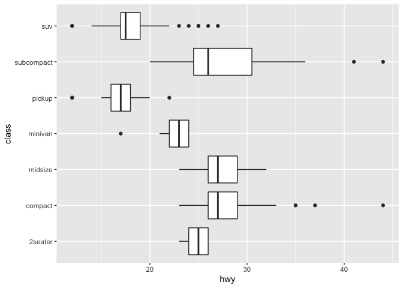

### Chapter 7: Exploratory Data Analysis 

```r
library(tidyverse)
```

```
## ── Attaching packages ─────────────────────────────────────── tidyverse 1.2.1 ──
```

```
## ✔ ggplot2 3.2.0     ✔ purrr   0.3.2
## ✔ tibble  2.1.3     ✔ dplyr   0.8.1
## ✔ tidyr   0.8.3     ✔ stringr 1.4.0
## ✔ readr   1.3.1     ✔ forcats 0.4.0
```

```
## Warning: package 'ggplot2' was built under R version 3.5.2
```

```
## Warning: package 'tibble' was built under R version 3.5.2
```

```
## Warning: package 'tidyr' was built under R version 3.5.2
```

```
## Warning: package 'purrr' was built under R version 3.5.2
```

```
## Warning: package 'dplyr' was built under R version 3.5.2
```

```
## Warning: package 'stringr' was built under R version 3.5.2
```

```
## Warning: package 'forcats' was built under R version 3.5.2
```

```
## ── Conflicts ────────────────────────────────────────── tidyverse_conflicts() ──
## ✖ dplyr::filter() masks stats::filter()
## ✖ dplyr::lag()    masks stats::lag()
```
#### 7.2: Questions
- When you ask yourselves questions regarding your data, it allows you to find ways to creatively analyze your data   
- "What type of variation occurs within my variables?"
- "What type of covariation occurs between my variables?"
- variable: quantity, quality, or property you can measure
- value: state of variable when you measure it (can change measurement to measurement)
- observation: set of measurements made under similar conditions 
- tabular data: a set of values each associated with a variable (column), and an observation (row)  

#### 7.3: Variation
- variation: tendency of the values of a variable to change from measurement to measurement 
- a variable is categorical if it can only take one of a small set of values 
- categorical vectors are usually saved as factors or character vectors
- to determine distribution of categorical variable, use a bar chart

```r
ggplot(data = diamonds) +
  geom_bar(mapping = aes(x = cut))
```

<!-- -->

- a variable is continuous if it can take any of an infinite set of ordered values (ex. numbers, dates, times)  
- use a histogram

```r
ggplot(data = diamonds) +
  geom_histogram(mapping = aes(x = carat), binwidth = 0.5)
```

<!-- -->

- you can change the bin width of the histogram with bindwidth argument: geom_histogram(binwidth = 0.1)
- if you wish to overlay many histograms, use geom_freqpoly which uses lines instead of bars

```r
ggplot(data = diamonds, mapping = aes(x = carat, colour = cut)) +
  geom_freqpoly(binwidth = 0.1)
```

<!-- -->

- questions to ask yourself
      - Which values are most common? Why?
      - Which values are rare? Why? Does that match your expectations?
      - Can you see any unusual patterns? What might explain them?
      - How are the observations within each cluster similar?
      - How are the observations in separate clusters different from each other?
      - How can you explain or describe the clusters?
      - Why might the appaearance of clusters be misleading?  

Unusual values or outliers
    - In histograms, there are so many values in the common bins that the rare bins are often hard to find
    - in order to get around this problem we have to zoom into the dataset, we can do that with the function  
  
coord_cartesian()
      - use xlim() within coord_cartesian() to zoom into x-axis 
      - use ylim() within coord_cartesian() to zoom into y-axis

Exercises (assigned problem set)  
1. Explore the distribution of each of the x, y, and z variables in diamonds. What do you learn? Think about a diamond and how you might decide which dimension is the length, width, and depth.    
- Based on my perceptions of diamonds, I'd assume x and y are length and width as the two have similar distributions and most diamonds have a prominent circular face (circles have similar lengths and widths). The z is designated to depth because its distribution is the least similar to x and y.   

```r
ggplot(data = diamonds) +
  geom_histogram(mapping = aes(x = x), binwidth = .1) +
  coord_cartesian(xlim = c(0, 10))
```

<!-- -->

```r
ggplot(data = diamonds) +
  geom_histogram(mapping = aes(x = y), binwidth = 0.1)+
  coord_cartesian(xlim = c(0, 10))
```

<!-- -->

```r
ggplot(data = diamonds) +
  geom_histogram(mapping = aes(x = z), binwidth = 0.1)+
  coord_cartesian(xlim = c(0, 10))
```

<!-- -->

2. Explore the distribution of price. Do you discover anything unusual or surprising? (Hint: Carefully think about the binwidth and make sure you try a wide range of values.) 

```r
ggplot(data = diamonds) +
  geom_histogram(mapping = aes(x = price), binwidth = 1)
```

<!-- -->

- There is a large range in the potential price of a diamond. I am surprised by how high the price of diamonds extends out to, but I am not spruprised that the majority of diamonds are less than 2500.   
3. How many diamonds are 0.99 carat? How many are 1 carat? What do you think is the cause of the difference?   
- While I do not have exact numbers, the number of 1 carat diamonds is much greater than the number of 0.99 carat diamonds. This is likely because .99 carat diamonds are passed off as 1 carat diamonds because they are close enough/ 1 carat diamonds are just more favored.   

```r
ggplot(data = diamonds) +
  geom_histogram(mapping = aes(x = carat), )+
  coord_cartesian(xlim = c(0, 3), (ylim = c(0, 1000)))
```

```
## `stat_bin()` using `bins = 30`. Pick better value with `binwidth`.
```

<!-- -->

4. Compare and contrast coord_cartesian() vs xlim() or ylim() when zooming in on a histogram. What happens if you leave binwidth unset? What happens if you try and zoom so only half a bar shows?   

```r
ggplot(data = diamonds) +
  geom_histogram(mapping = aes(x = carat),)+
  xlim(0, 3)+
  ylim(0, 1000)
```

```
## `stat_bin()` using `bins = 30`. Pick better value with `binwidth`.
```

```
## Warning: Removed 32 rows containing non-finite values (stat_bin).
```

```
## Warning: Removed 14 rows containing missing values (geom_bar).
```

<!-- -->

- coord_cartesian zooms in, cutting off bars that exceed the limits placed. xlim and ylim zoom in and then remove rows that bars that exceed the limits. That's why the xlim/ylim graph is emptier than the coord_cartesian graph.  

#### 7.4: Missing Values
- if there are unusual values you want to remove, replace them with missing values by using the mutate function in conjunction with the ifelse() function

```r
diamonds2 <- diamonds %>% 
  mutate(y = ifelse(y < 3 | y > 20, NA, y))
```

```r
ggplot(data = diamonds2, mapping = aes(x = x, y = y)) + 
  geom_point()
```

```
## Warning: Removed 9 rows containing missing values (geom_point).
```

<!-- -->

exercises (assigned problem set)  

1. What happens to missing values in a histogram? What happens to missing values in a bar chart? Why is there a difference?

```r
ggplot(data = diamonds2, mapping = aes(x = y)) + 
  geom_bar()+
   xlim(0, 5)
```

```
## Warning: Removed 36326 rows containing non-finite values (stat_count).
```

```
## Warning: Removed 1 rows containing missing values (geom_bar).
```

<!-- -->

- The only difference I notice is the amount of rows removed from each graph. geom_bar removes 1 row containing missing values, while the histogram removes 2  

2. What does na.rm = TRUE do in mean() and sum()?
- na.rm = TRUE means that missing values should be removed before computing the mean/sum. 

#### 7.5: Covariation
- covariation: the tendency of two or more variables to vary together in a related way
Continous and Categorical  
- a way to show the distribution of a continuous variable by categorical variable is a boxplot

```r
ggplot(data = mpg, mapping = aes(x = class, y = hwy)) +
  geom_boxplot()
```

<!-- -->

- can flip a boxplot by 90 degrees

```r
ggplot(data = mpg, mapping = aes(x = class, y = hwy)) +
  geom_boxplot()+
  coord_flip()
```

<!-- -->

Exercises (assigned problem set )

```r
library("nycflights13")
```
1. Use what you’ve learned to improve the visualisation of the departure times of cancelled vs. non-cancelled flights.


```r
flights_c <- mutate(flights,
  cancelled = is.na(dep_time)
  )
```

```r
flights_c
```

```
## # A tibble: 336,776 x 20
##     year month   day dep_time sched_dep_time dep_delay arr_time
##    <int> <int> <int>    <int>          <int>     <dbl>    <int>
##  1  2013     1     1      517            515         2      830
##  2  2013     1     1      533            529         4      850
##  3  2013     1     1      542            540         2      923
##  4  2013     1     1      544            545        -1     1004
##  5  2013     1     1      554            600        -6      812
##  6  2013     1     1      554            558        -4      740
##  7  2013     1     1      555            600        -5      913
##  8  2013     1     1      557            600        -3      709
##  9  2013     1     1      557            600        -3      838
## 10  2013     1     1      558            600        -2      753
## # … with 336,766 more rows, and 13 more variables: sched_arr_time <int>,
## #   arr_delay <dbl>, carrier <chr>, flight <int>, tailnum <chr>,
## #   origin <chr>, dest <chr>, air_time <dbl>, distance <dbl>, hour <dbl>,
## #   minute <dbl>, time_hour <dttm>, cancelled <lgl>
```

```r
ggplot(flights_c, aes(x= carrier, y = sched_dep_time))+
  geom_boxplot()+
  facet_wrap(~cancelled)
```

<!-- -->

- False is noncancelled and True is cancelled flights  
2. What variable in the diamonds dataset is most important for predicting the price of a diamond? How is that variable correlated with cut? Why does the combination of those two relationships lead to lower quality diamonds being more expensive?

```r
ggplot(data = diamonds, mapping = aes(x = cut, y = carat)) +
  geom_boxplot()+
  coord_flip()
```

<!-- -->

```r
ggplot(data = diamonds, mapping = aes(x = cut, y = price)) +
  geom_boxplot()+
  coord_flip()
```

<!-- -->

```r
ggplot(data = diamonds, mapping = aes(x = carat, y = price)) + 
  geom_boxplot(mapping = aes(group = cut_width(carat, 0.1)))
```

<!-- -->

- The cut and price relationship is largely affected by carat. In general, as carat increases, price increases. So lower quality diamonds with higher carats are more likely to be pricier than high quality diamonds with lower carats.   
3. Install the ggstance package, and create a horizontal boxplot. How does this compare to using coord_flip()?

```r
library("ggstance")
```

```
## Warning: package 'ggstance' was built under R version 3.5.2
```

```
## 
## Attaching package: 'ggstance'
```

```
## The following objects are masked from 'package:ggplot2':
## 
##     geom_errorbarh, GeomErrorbarh
```

```r
ggplot(data = mpg) +
  geom_boxploth(mapping = aes(x = class, y = hwy))
```

<!-- -->

IDK  

5. Compare and contrast geom_violin() with a facetted geom_histogram(), or a coloured geom_freqpoly(). What are the pros and cons of each method?  
- geom_violin()

```r
ggplot(data = diamonds, mapping = aes(x = price, y = carat)) + 
  geom_violin(mapping = aes(colour = cut))
```

```
## Warning: position_dodge requires non-overlapping x intervals
```

<!-- -->
 
    - Pros: I honestly don't like this style of graph but I guess it presents the data in an aesthetically pleasing way  
    - Cons: I don't really understand this style of graph. It confuses me with all the overlapping and its shape  
- facetted geom_histogram

```r
ggplot(diamonds, mapping = aes(x = carat)) + 
  geom_histogram(binwidth = 0.5)+
  facet_wrap(~cut)
```

<!-- -->
  
    - Pros: Easy to visualize and understand subgroups
    - Cons: isn't the greatest for direct comparison
- colored geom_freqpoly()

```r
ggplot(data = diamonds, mapping = aes(x = price, y = ..density..)) + 
  geom_freqpoly(mapping = aes(colour = cut), binwidth = 500)
```

<!-- -->
  
  - Pros: allows you to directly compare different subgroups
  - Cons: Isn't the greatest for looking at individual subgroups since they are so intertwined  
6. If you have a small dataset, it’s sometimes useful to use geom_jitter() to see the relationship between a continuous and categorical variable. The ggbeeswarm package provides a number of methods similar to geom_jitter(). List them and briefly describe what each one does.

```r
library("ggbeeswarm")
```
- functions similar to geom_jitter are geom_quasirandom and geom_beeswarm which form scatterplot violin graphs 

2 Categorical   
- a great way to represent two categorical variables is the geom_count function

```r
library(tidyverse)
```

```r
ggplot(data = diamonds) +
  geom_count(mapping = aes(x = cut, y = color))
```

<!-- -->

- another way is to combine count with the geom_tile() function 

```r
diamonds %>% 
  count(color, cut) %>%  
  ggplot(mapping = aes(x = color, y = cut)) +
    geom_tile(mapping = aes(fill = n))
```

<!-- -->

- An experiment with two categorical variables
    - You are trying to determine what the most predominant pollinator in the region is. One variable is flower/plant (Rose, sunflower, hyacinth, violets), the other is pollinator (bees, hummingbirds, moths, bats, small rodents). 
    
Two continuous variables

    - one way to represent data with 2 continuous is by using a scatter plot (geom_point())
    - another is to combine geom_point with the alpha aesthetic 

```r
ggplot(data = diamonds) + 
  geom_point(mapping = aes(x = carat, y = price), alpha = 1 / 100)
```

<!-- -->

- geom_bin2d() allows you to bin in 2 dimensions

```r
ggplot(data = diamonds) +
  geom_bin2d(mapping = aes(x = carat, y = price))
```

<!-- -->

- another way is to treat a continous variable like a categorical variable and bin it

```r
ggplot(data = diamonds, mapping = aes(x = carat, y = price)) + 
  geom_boxplot(mapping = aes(group = cut_width(carat, 0.1)))
```

<!-- -->

- an experiment with two continous variables 
    - the hypocotyl elongation experiment we are doing in which one variable is the Days after germination, while the other is hypocotyl elongation. This one also serves as an example of 2 continous variables where one can be treated like a categorical to use a boxplot.    

#### 7.6: Patterns
- questions to ask yourself about patterns
  - Could this pattern be due to coincidence?
  - How can you describe the relationship implied by the pattern?
  - How strong is the relationship?
  - What other variables might affect this relationship?
  - Does this relationship appear in smaller subgroups?

#### 7.7: ggplot2 calls
- our code can be written more concisely now that we understand the basics
for example:  
ggplot(data = faithful, mapping = aes(x = eruptions)) +   
  geom_freqpoly(binwidth = 0.25)  
becomes:  
ggplot(faithful, aes(eruptions)) +   
  geom_freqpoly(binwidth = 0.25)  

### Chapter 8: Workflow: Projects

#### 8.1: What is real?
- it is important to consider your R script as real and not the "envrionment" or workspace. 
- the textbook recommends instructing R to not save your workspace between sessions so you can get used to this behavior
- it forces you to capture all important interactions in your code
#### 8.5: Summary
1. Create an RStudio project for each data analysis project
2. Keep data files there
3. Keep scripts there, run them as bits or as whole
4. Save your outputs there
5. Only use relative paths, not absolute paths 
