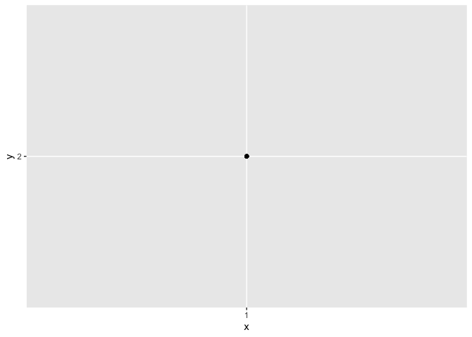

### Chapter 9: Introduction to Wrangling  
- There are 3 parts of data wrangling    
  - in tibbles, i'll learn about the variant of data sets known as tibbles  
  - in data import,i'll learn how to import data    
  - in tidy data, learn how to tidt data which makes storing, visualizing and modelling easier    
- Other skills      
  - relational data: working with multiple data sets  
  - Strings: a powerful tool for manipulating strings 
  - Factors is how R stores categorical data   
  - Dates and Times

### Chapter 10: Tibbles

```r
library(tidyverse)
```

```
## ── Attaching packages ─────────────────────────────────────── tidyverse 1.2.1 ──
```

```
## ✔ ggplot2 3.2.0     ✔ purrr   0.3.2
## ✔ tibble  2.1.3     ✔ dplyr   0.8.1
## ✔ tidyr   0.8.3     ✔ stringr 1.4.0
## ✔ readr   1.3.1     ✔ forcats 0.4.0
```

```
## Warning: package 'ggplot2' was built under R version 3.5.2
```

```
## Warning: package 'tibble' was built under R version 3.5.2
```

```
## Warning: package 'tidyr' was built under R version 3.5.2
```

```
## Warning: package 'purrr' was built under R version 3.5.2
```

```
## Warning: package 'dplyr' was built under R version 3.5.2
```

```
## Warning: package 'stringr' was built under R version 3.5.2
```

```
## Warning: package 'forcats' was built under R version 3.5.2
```

```
## ── Conflicts ────────────────────────────────────────── tidyverse_conflicts() ──
## ✖ dplyr::filter() masks stats::filter()
## ✖ dplyr::lag()    masks stats::lag()
```

#### 10.2 Creating Tibbles  
- converting regular data frames into tibbles

```r
as_tibble(iris)
```

```
## # A tibble: 150 x 5
##    Sepal.Length Sepal.Width Petal.Length Petal.Width Species
##           <dbl>       <dbl>        <dbl>       <dbl> <fct>  
##  1          5.1         3.5          1.4         0.2 setosa 
##  2          4.9         3            1.4         0.2 setosa 
##  3          4.7         3.2          1.3         0.2 setosa 
##  4          4.6         3.1          1.5         0.2 setosa 
##  5          5           3.6          1.4         0.2 setosa 
##  6          5.4         3.9          1.7         0.4 setosa 
##  7          4.6         3.4          1.4         0.3 setosa 
##  8          5           3.4          1.5         0.2 setosa 
##  9          4.4         2.9          1.4         0.2 setosa 
## 10          4.9         3.1          1.5         0.1 setosa 
## # … with 140 more rows
```
- you can create Tibbles with individual vectors  

```r
tibble(
  x = 1:5, 
  y = 1, 
  z = x ^ 2 + y
)
```

```
## # A tibble: 5 x 3
##       x     y     z
##   <int> <dbl> <dbl>
## 1     1     1     2
## 2     2     1     5
## 3     3     1    10
## 4     4     1    17
## 5     5     1    26
```
- tibble will automatically recyle inputs of length 1 and allows you to refer to variables  
- it's possible for a tibble to have unusual names as long as they are surround by ``  
  - For example, ' ', '2000'  
- tribble(), or transposed tribble, column heading defined by ~ and entries are separated by , 

```r
tribble(
  ~x, ~y, ~z,
  #--|--|----
  "a", 2, 3.6,
  "b", 1, 8.5
)
```

```
## # A tibble: 2 x 3
##   x         y     z
##   <chr> <dbl> <dbl>
## 1 a         2   3.6
## 2 b         1   8.5
```
 
#### 10.3: Tibbles vs data frame
- there are two main differences between tibbles vs. classic data.frame: printing and subsetting  
Printing    
- Tibbles print method yields first 10 rows and all columns that fit on screen      
Alternative ways to control how you print    
- print()  
  - use n to control the number of roles and width to display column (width = Inf displays all columns)  

```r
nycflights13::flights %>% 
  print(n = 10, width = Inf)
```

```
## # A tibble: 336,776 x 19
##     year month   day dep_time sched_dep_time dep_delay arr_time
##    <int> <int> <int>    <int>          <int>     <dbl>    <int>
##  1  2013     1     1      517            515         2      830
##  2  2013     1     1      533            529         4      850
##  3  2013     1     1      542            540         2      923
##  4  2013     1     1      544            545        -1     1004
##  5  2013     1     1      554            600        -6      812
##  6  2013     1     1      554            558        -4      740
##  7  2013     1     1      555            600        -5      913
##  8  2013     1     1      557            600        -3      709
##  9  2013     1     1      557            600        -3      838
## 10  2013     1     1      558            600        -2      753
##    sched_arr_time arr_delay carrier flight tailnum origin dest  air_time
##             <int>     <dbl> <chr>    <int> <chr>   <chr>  <chr>    <dbl>
##  1            819        11 UA        1545 N14228  EWR    IAH        227
##  2            830        20 UA        1714 N24211  LGA    IAH        227
##  3            850        33 AA        1141 N619AA  JFK    MIA        160
##  4           1022       -18 B6         725 N804JB  JFK    BQN        183
##  5            837       -25 DL         461 N668DN  LGA    ATL        116
##  6            728        12 UA        1696 N39463  EWR    ORD        150
##  7            854        19 B6         507 N516JB  EWR    FLL        158
##  8            723       -14 EV        5708 N829AS  LGA    IAD         53
##  9            846        -8 B6          79 N593JB  JFK    MCO        140
## 10            745         8 AA         301 N3ALAA  LGA    ORD        138
##    distance  hour minute time_hour          
##       <dbl> <dbl>  <dbl> <dttm>             
##  1     1400     5     15 2013-01-01 05:00:00
##  2     1416     5     29 2013-01-01 05:00:00
##  3     1089     5     40 2013-01-01 05:00:00
##  4     1576     5     45 2013-01-01 05:00:00
##  5      762     6      0 2013-01-01 06:00:00
##  6      719     5     58 2013-01-01 05:00:00
##  7     1065     6      0 2013-01-01 06:00:00
##  8      229     6      0 2013-01-01 06:00:00
##  9      944     6      0 2013-01-01 06:00:00
## 10      733     6      0 2013-01-01 06:00:00
## # … with 3.368e+05 more rows
```
- ways to set the options for print  
  - options(tibble.print_max = n, tibble.print_min = m)  
  - options(tibble.print_min = Inf)  to print all columns  
- view()  
Subsetting   
- tools to subset   
  -[[]] can extract name or position     
  - $ only extracts name  

```r
df <- tibble(
  x = runif(5),
  y = rnorm(5)
)
```

```r
df$x
```

```
## [1] 0.2218930 0.9472012 0.4552036 0.4013637 0.5855238
```
- to use this in a pipe you'll need the place holder . 

```r
df %>% .$x
```

```
## [1] 0.2218930 0.9472012 0.4552036 0.4013637 0.5855238
```

#### 10.4 Interacting with older code  
- some older functions don't work with tibbles, so you can convert back to a regular data set by using the as.data.frame()   

```r
class(as.data.frame(iris))
```

```
## [1] "data.frame"
```

#### 10.5 Exercises  
1. How can you tell if an object is a tibble? (Hint: try printing mtcars, which is a regular data frame)

```r
mtcars
```

```
##                      mpg cyl  disp  hp drat    wt  qsec vs am gear carb
## Mazda RX4           21.0   6 160.0 110 3.90 2.620 16.46  0  1    4    4
## Mazda RX4 Wag       21.0   6 160.0 110 3.90 2.875 17.02  0  1    4    4
## Datsun 710          22.8   4 108.0  93 3.85 2.320 18.61  1  1    4    1
## Hornet 4 Drive      21.4   6 258.0 110 3.08 3.215 19.44  1  0    3    1
## Hornet Sportabout   18.7   8 360.0 175 3.15 3.440 17.02  0  0    3    2
## Valiant             18.1   6 225.0 105 2.76 3.460 20.22  1  0    3    1
## Duster 360          14.3   8 360.0 245 3.21 3.570 15.84  0  0    3    4
## Merc 240D           24.4   4 146.7  62 3.69 3.190 20.00  1  0    4    2
## Merc 230            22.8   4 140.8  95 3.92 3.150 22.90  1  0    4    2
## Merc 280            19.2   6 167.6 123 3.92 3.440 18.30  1  0    4    4
## Merc 280C           17.8   6 167.6 123 3.92 3.440 18.90  1  0    4    4
## Merc 450SE          16.4   8 275.8 180 3.07 4.070 17.40  0  0    3    3
## Merc 450SL          17.3   8 275.8 180 3.07 3.730 17.60  0  0    3    3
## Merc 450SLC         15.2   8 275.8 180 3.07 3.780 18.00  0  0    3    3
## Cadillac Fleetwood  10.4   8 472.0 205 2.93 5.250 17.98  0  0    3    4
## Lincoln Continental 10.4   8 460.0 215 3.00 5.424 17.82  0  0    3    4
## Chrysler Imperial   14.7   8 440.0 230 3.23 5.345 17.42  0  0    3    4
## Fiat 128            32.4   4  78.7  66 4.08 2.200 19.47  1  1    4    1
## Honda Civic         30.4   4  75.7  52 4.93 1.615 18.52  1  1    4    2
## Toyota Corolla      33.9   4  71.1  65 4.22 1.835 19.90  1  1    4    1
## Toyota Corona       21.5   4 120.1  97 3.70 2.465 20.01  1  0    3    1
## Dodge Challenger    15.5   8 318.0 150 2.76 3.520 16.87  0  0    3    2
## AMC Javelin         15.2   8 304.0 150 3.15 3.435 17.30  0  0    3    2
## Camaro Z28          13.3   8 350.0 245 3.73 3.840 15.41  0  0    3    4
## Pontiac Firebird    19.2   8 400.0 175 3.08 3.845 17.05  0  0    3    2
## Fiat X1-9           27.3   4  79.0  66 4.08 1.935 18.90  1  1    4    1
## Porsche 914-2       26.0   4 120.3  91 4.43 2.140 16.70  0  1    5    2
## Lotus Europa        30.4   4  95.1 113 3.77 1.513 16.90  1  1    5    2
## Ford Pantera L      15.8   8 351.0 264 4.22 3.170 14.50  0  1    5    4
## Ferrari Dino        19.7   6 145.0 175 3.62 2.770 15.50  0  1    5    6
## Maserati Bora       15.0   8 301.0 335 3.54 3.570 14.60  0  1    5    8
## Volvo 142E          21.4   4 121.0 109 4.11 2.780 18.60  1  1    4    2
```
- tibbles typically show only the number of columns that will fit on the screen instead of allowing multiple pages of columns.    
2.Compare and contrast the following operations on a data.frame and equivalent tibble. What is different? Why might the default data frame behaviours cause you frustration?  

```r
df <- data.frame(abc = 1, xyz = "a")
df[, c("abc", "xyz")]
```

```
##   abc xyz
## 1   1   a
```
- I can't think of major differences aside from I feel that tibble displays what you called in a clearer more "printed"" way. Tibbles version seems like a version that is accessible and usuable.  
4. Practice referring to non-syntactic names in the following data frame by:  

```r
annoying <- tibble(
  `1` = 1:10,
  `2` = `1` * 2 + rnorm(length(`1`))
)
```
- Extracting the variable called 1.  

```r
annoying$`1`
```

```
##  [1]  1  2  3  4  5  6  7  8  9 10
```
- Plotting a scatterplot of 1 vs 2.  

```r
ggplot(annoying)+
  geom_point(mapping=aes(x='1',y='2'))
```

<!-- -->

- Creating a new column called 3 which is 2 divided by 1.  

```r
as.tibble(annoying)
```

```
## Warning: `as.tibble()` is deprecated, use `as_tibble()` (but mind the new semantics).
## This warning is displayed once per session.
```

```
## # A tibble: 10 x 2
##      `1`   `2`
##    <int> <dbl>
##  1     1  1.39
##  2     2  3.55
##  3     3  3.64
##  4     4  9.16
##  5     5 11.6 
##  6     6 12.7 
##  7     7 14.0 
##  8     8 17.1 
##  9     9 15.9 
## 10    10 20.5
```

```r
 annoying2 <- mutate(annoying,
        `3` = `2` / `1`)
```

```r
annoying2
```

```
## # A tibble: 10 x 3
##      `1`   `2`   `3`
##    <int> <dbl> <dbl>
##  1     1  1.39  1.39
##  2     2  3.55  1.77
##  3     3  3.64  1.21
##  4     4  9.16  2.29
##  5     5 11.6   2.32
##  6     6 12.7   2.11
##  7     7 14.0   2.00
##  8     8 17.1   2.14
##  9     9 15.9   1.77
## 10    10 20.5   2.05
```
- Renaming the columns to one, two and three.  

```r
names(annoying2) <- c("one", "two", "three")
```

```r
names(annoying2) 
```

```
## [1] "one"   "two"   "three"
```
5. What does tibble::enframe() do? When might you use it?  

```r
?tibble::enframe()
```
- It converts vectors into data frames. When you need to quickly convert vectors, specifically categorical data, into a tibble.  

### Chapter 11: Data import

#### 11.2: Getting started
- turning flat files into data frames    
  - read_csv(): reads comma delimited files  
  - read_csv2(): reads semicolon separated files  
  - read_tsv(): reads tab delimited files   
  - read_delim(): reads in files with any delimiter  
  - read_fwf(): reads fixed width files  
  - fwf_widths(): specify fields by their width  
  - fwf_positions(): specify fields by their position  
  - read_table(): reads a common variation of fixed width files where columns are separated by white space   
  - read_log(): reads Apache style log files    
- read_csv() uses the first line of the data for the column names  
- cases where you wouldn't want that to be the case:  
  1. Metadata at the top of the file (Use skip = n to skip the first n lines or use comment = "#" to drop all lines that start with #)  

```r
read_csv("The first line of metadata
  The second line of metadata
  x,y,z
  1,2,3", skip = 2)
```

```
## # A tibble: 1 x 3
##       x     y     z
##   <dbl> <dbl> <dbl>
## 1     1     2     3
```

```r
read_csv("# A comment I want to skip
  x,y,z
  1,2,3", comment = "#")
```

```
## # A tibble: 1 x 3
##       x     y     z
##   <dbl> <dbl> <dbl>
## 1     1     2     3
```
  2. The data might not have column names. (use col_names=FALSE to not treat the first row as headings and instead label them X1 to Xn)  
- you can also use col_names = a character vector which will be used as the column names  
Exercises  
1. What function would you use to read a file where fields were separated with
“|”?  
- read_delim()
4. Sometimes strings in a CSV file contain commas. To prevent them from causing problems they need to be surrounded by a quoting character, like " or '. By convention, read_csv() assumes that the quoting character will be ", and if you want to change it you’ll need to use read_delim() instead. What arguments do you need to specify to read the following text into a data frame?  
"x,y\n1,'a,b'"  

```r
?read.delim
```
- I can't figure out how to change the quote.
5. Identify what is wrong with each of the following inline CSV files. What happens when you run the code?

```r
read_csv("a,b,c\n1,2,3\n4,5,6")
```

```
## # A tibble: 2 x 3
##       a     b     c
##   <dbl> <dbl> <dbl>
## 1     1     2     3
## 2     4     5     6
```
- needed an extra column

```r
read_csv("a,b,c,d\n1,2,3,4\n1,2,3,4")
```

```
## # A tibble: 2 x 4
##       a     b     c     d
##   <dbl> <dbl> <dbl> <dbl>
## 1     1     2     3     4
## 2     1     2     3     4
```
- There wasn't the correct number of columns and rows 


```r
read_csv("a,b\n1,2")
```

```
## # A tibble: 1 x 2
##       a     b
##   <dbl> <dbl>
## 1     1     2
```
- There was an extra "\" where there shouldnt have been, and there wasn't a value for the b column

```r
read_csv("a,b\n1,2\na,b")
```

```
## # A tibble: 2 x 2
##   a     b    
##   <chr> <chr>
## 1 1     2    
## 2 a     b
```
- There doesn't seem to be an issue, but now the variables are labelled as characters instead of dbl. 

```r
read_csv2("a;b\n1;3")
```

```
## Using ',' as decimal and '.' as grouping mark. Use read_delim() for more control.
```

```
## # A tibble: 1 x 2
##       a     b
##   <dbl> <dbl>
## 1     1     3
```
- needs to be read_csv2 or read_delim instead of read_csv.   
- In general, parsing failures occured. 

#### 11.3: Parsing a vector
- parse_*(): take a character vector and return a more specialized vector 
- parsing fails you will get a warning and the failures will be missing in the output 
- problems() will show you the complete set if there are multiple failures
- types of parse functions  
    - parse_logical
    - parse_integer
    - parse_double
    - parse_number
    - parse_character
    - parse_factor
    - parse_datetime, parse_date, parse_time  
- parse_number works around non-numeric characters that might surround numbers, making it easy to work with percentages and money  
- decimal_mark argument allows users to change the decimal point from , to . or vice versa
- parse_number also ignores grouping characters (ex. 1,000 - > 1000)
- parse_datetime organizes components of the date from biggest to smallest: year, month, day, hour, minute, second  
- parse_date expects 0000/00/00 or 0000-00-00
- parse_time expects hour:minute:seconds am/pm (optional)
- other data time format stuff:  
    - %Y: 4-digit year
    - %y: 2-digit year
    - %m: 2-digit month
    - %b: abbreviated month names
    - %B: full month names   
exercises  
1. What are the most important arguments to locale()?

```r
?locale
```
- decimal_mark, grouping_mark, as well as date_format and time_format.
2. What happens if you try and set decimal_mark and grouping_mark to the same character? What happens to the default value of grouping_mark when you set decimal_mark to “,”? What happens to the default value of decimal_mark when you set the grouping_mark to “.”?

```r
parse_double("1,230.16", locale = locale(decimal_mark = "."))
```

```
## Warning: 1 parsing failure.
## row col               expected  actual
##   1  -- no trailing characters ,230.16
```

```
## [1] NA
## attr(,"problems")
## # A tibble: 1 x 4
##     row   col expected               actual 
##   <int> <int> <chr>                  <chr>  
## 1     1    NA no trailing characters ,230.16
```
- There is an error because the grouping mark and the decimal mark can't be the same. I can't tell what it turns the default values into because 
3. I didn’t discuss the date_format and time_format options to locale(). What do they do? Construct an example that shows when they might be useful.

```r
str(parse_guess("01/02/2013", locale = locale(date_format = "%d/%m/%Y")))
```

```
##  Date[1:1], format: "2013-02-01"
```
- date_format and time_format delineate the different ways R can parse the data. They might be useful when converting one way writing dates to another, like when reports from other countries need to be incorporated into our datasets. 
7. Generate the correct format string to parse each of the following dates and times:  
d1 <- "2010-01-01"  
d2 <- "2015-03-07"  
d3 <- "2017-06-06"  
d4 <- c("2015-08-19", "2015-07-01")  
d5 <- "2014-12-30" # Dec 30, 2014  
t1 <- "17:05"  
t2 <- "11:15:10:12 pm"  

#### 11.4: Parsing a file
- guess_parser(): returns readr's best guess of what the parse was
- parse_guess(): uses that guess to parse the column 
- potential problems with readr  
  1. readr observes the first thousand rows and the precedent set by the first thousand rows may not reflect the entire column  
  2. There may be many NA in the column which could cause readr to delineate it as a character vector instead of something more specific/accurate  

#### 11.5: Writing to a file
- write_tsv() and write_csv() are useful functions for writing data back to disc
- if you wanted to export a csv to excell: write_excell_csv()
- write_csv(challenge, "challenge.csv"): challenge is the data frame to save and "challenge.csv" is the location  

#### 11.6: Other Types of Data
- haven: for SPSS, Stata, and SAS files
- readxl: for excel files
- DBI: allows you to run SQL queries against a database and return a data frame
