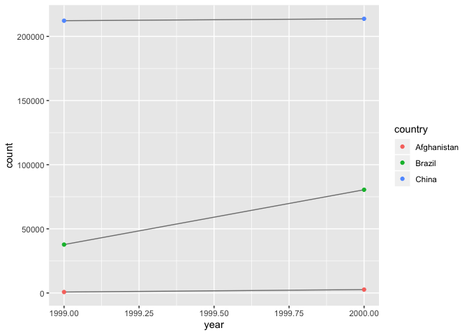
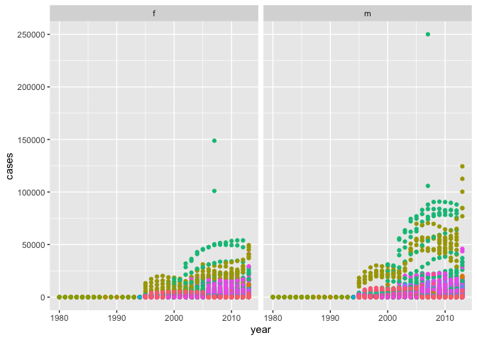

### Chapter 12: Tidy Data

#### 12.1: Prerequisities 

```r
library(tidyverse)
```

```
## ── Attaching packages ───────────────────────────────────────────────────────────────── tidyverse 1.2.1 ──
```

```
## ✔ ggplot2 3.2.0     ✔ purrr   0.3.2
## ✔ tibble  2.1.3     ✔ dplyr   0.8.1
## ✔ tidyr   0.8.3     ✔ stringr 1.4.0
## ✔ readr   1.3.1     ✔ forcats 0.4.0
```

```
## Warning: package 'ggplot2' was built under R version 3.5.2
```

```
## Warning: package 'tibble' was built under R version 3.5.2
```

```
## Warning: package 'tidyr' was built under R version 3.5.2
```

```
## Warning: package 'purrr' was built under R version 3.5.2
```

```
## Warning: package 'dplyr' was built under R version 3.5.2
```

```
## Warning: package 'stringr' was built under R version 3.5.2
```

```
## Warning: package 'forcats' was built under R version 3.5.2
```

```
## ── Conflicts ──────────────────────────────────────────────────────────────────── tidyverse_conflicts() ──
## ✖ dplyr::filter() masks stats::filter()
## ✖ dplyr::lag()    masks stats::lag()
```

#### 12.2: Tidy data
- There are the rules which make a dataset tidy:  
    - Each variable must have its own column  
    - Each observation must have its own row  
    - Each value must have its own cell  
- These rules lead to a simpler set of instructions: put each dataset in a tibble and put each variable in a column  
- ensuring your data is tidy is advatageous because it ensures you have one consistent way of storing data and tidy data works good with mutate and summary functions  
Exercises  
2. Compute the rate for table2, and table4a + table4b. You will need to perform four operations:  
    1. Extract the number of TB cases per country per year.  
    2. Extract the matching population per country per year.  
    3. Divide cases by population, and multiply by 10000.  
    4. Store back in the appropriate place.  

```r
table2.1 <- filter(table2, type == "cases")
```

```r
table2.1 
```

```
## # A tibble: 6 x 4
##   country      year type   count
##   <chr>       <int> <chr>  <int>
## 1 Afghanistan  1999 cases    745
## 2 Afghanistan  2000 cases   2666
## 3 Brazil       1999 cases  37737
## 4 Brazil       2000 cases  80488
## 5 China        1999 cases 212258
## 6 China        2000 cases 213766
```

```r
table2.2 <- filter(table2, type == "population")
```

```r
table2.3 <- table2.1$count / table2.2$count *10000
```

```r
table2.3 <- c( 0.372741, 0.372741, 1.294466, 1.294466, 2.193930, 2.193930, 4.612363, 4.612363, 1.667495, 1.667495, 1.669488, 1.669488) 
```

```r
table2 %>%
  mutate(rate = table2.3)
```

```
## # A tibble: 12 x 5
##    country      year type            count  rate
##    <chr>       <int> <chr>           <int> <dbl>
##  1 Afghanistan  1999 cases             745 0.373
##  2 Afghanistan  1999 population   19987071 0.373
##  3 Afghanistan  2000 cases            2666 1.29 
##  4 Afghanistan  2000 population   20595360 1.29 
##  5 Brazil       1999 cases           37737 2.19 
##  6 Brazil       1999 population  172006362 2.19 
##  7 Brazil       2000 cases           80488 4.61 
##  8 Brazil       2000 population  174504898 4.61 
##  9 China        1999 cases          212258 1.67 
## 10 China        1999 population 1272915272 1.67 
## 11 China        2000 cases          213766 1.67 
## 12 China        2000 population 1280428583 1.67
```
Which representation is easiest to work with? Which is hardest? Why?  
- Without attempting to do 4a+4b I am going to say it is the hardest style to work with. The reason being is that I'd have to do double the work I did for table2, but I would have no way to store it in a way that is appropriate. Because it doesn't fit within the framework of either of the graphs. I'd have to make a new dataset which just seems like too much effort.  
3. Recreate the plot showing change in cases over time using table2 instead of table1. What do you need to do first?  

```r
library(ggplot2)
ggplot(table2.1, aes(year, count)) + 
  geom_line(aes(group = country), colour = "grey50") + 
  geom_point(aes(colour = country))
```

<!-- -->

- What you have to do is filter out the types that are not cases, so you are left with the count values that are the case numbers.

#### 12.3: Spreading and Gathering
Gathering  
- gathering helps solve the problem of the column names that are not names of variables, but values of a variable
- the name of the variable whose values form the column names is the key.  
- the name of the variable whose values are spread over the cells is the value

```r
table4a %>% 
  gather(`1999`, `2000`, key = "year", value = "cases")
```

```
## # A tibble: 6 x 3
##   country     year   cases
##   <chr>       <chr>  <int>
## 1 Afghanistan 1999     745
## 2 Brazil      1999   37737
## 3 China       1999  212258
## 4 Afghanistan 2000    2666
## 5 Brazil      2000   80488
## 6 China       2000  213766
```

```r
table4b %>% 
  gather(`1999`, `2000`, key = "year", value = "population")
```

```
## # A tibble: 6 x 3
##   country     year  population
##   <chr>       <chr>      <int>
## 1 Afghanistan 1999    19987071
## 2 Brazil      1999   172006362
## 3 China       1999  1272915272
## 4 Afghanistan 2000    20595360
## 5 Brazil      2000   174504898
## 6 China       2000  1280428583
```
- left_join() can combine the tidied version of two tables into a single tibble

```r
tidy4a <- table4a %>% 
  gather(`1999`, `2000`, key = "year", value = "cases")
tidy4b <- table4b %>% 
  gather(`1999`, `2000`, key = "year", value = "population")
left_join(tidy4a, tidy4b)
```

```
## Joining, by = c("country", "year")
```

```
## # A tibble: 6 x 4
##   country     year   cases population
##   <chr>       <chr>  <int>      <int>
## 1 Afghanistan 1999     745   19987071
## 2 Brazil      1999   37737  172006362
## 3 China       1999  212258 1272915272
## 4 Afghanistan 2000    2666   20595360
## 5 Brazil      2000   80488  174504898
## 6 China       2000  213766 1280428583
```
Spreading    
- spreading is the opposite of gathering: you use it when an observation is scattered across multiple rows  
- the column that contains variable names is the key  
- the column that contains values from multiple variables is the value

```r
table2 %>%
    spread(key = type, value = count)
```

```
## # A tibble: 6 x 4
##   country      year  cases population
##   <chr>       <int>  <int>      <int>
## 1 Afghanistan  1999    745   19987071
## 2 Afghanistan  2000   2666   20595360
## 3 Brazil       1999  37737  172006362
## 4 Brazil       2000  80488  174504898
## 5 China        1999 212258 1272915272
## 6 China        2000 213766 1280428583
```
Exercises  
1. Why are gather() and spread() not perfectly symmetrical?  

```r
stocks <- tibble(
  year   = c(2015, 2015, 2016, 2016),
  half  = c(   1,    2,     1,    2),
  return = c(1.88, 0.59, 0.92, 0.17)
)
```

```r
?gather
```
- I do not know how to answer in terms of symmetry. it's clear that gather and spread do the opposite functions in this example. Convert changes the columns automatically to their type. While cases is a character value, when it is gathered it becomes an integer column.
2.  Why does this code fail?

```r
table4a %>% 
  gather('1999', '2000', key = "year", value = "cases")
```

```
## # A tibble: 6 x 3
##   country     year   cases
##   <chr>       <chr>  <int>
## 1 Afghanistan 1999     745
## 2 Brazil      1999   37737
## 3 China       1999  212258
## 4 Afghanistan 2000    2666
## 5 Brazil      2000   80488
## 6 China       2000  213766
```
- 1999 and 2000 weren't suround by ''. 
3. Why does spreading this tibble fail? How could you add a new column to fix the problem?

```r
people <- tribble(
  ~name,             ~key,    ~value,
  #-----------------|--------|------
  "Phillip Woods",   "age",       45,
  "Phillip Woods",   "height",   186,
  "Phillip Woods",   "age",       50,
  "Jessica Cordero", "age",       37,
  "Jessica Cordero", "height",   156
)
```
people %>%  
    spread(key = key, value = value)  

```r
?rowid_to_column
```
- Spreading this tibble fails because Phillip Woods has an extra age than Jessica Cordero. You could rowid_to_column. 
4. Tidy the simple tibble below. Do you need to spread or gather it? What are the variables?  

```r
preg <- tribble(
  ~pregnant, ~male, ~female,
  "yes",     NA,    10,
  "no",      20,    12
)
```

```r
preg 
```

```
## # A tibble: 2 x 3
##   pregnant  male female
##   <chr>    <dbl>  <dbl>
## 1 yes         NA     10
## 2 no          20     12
```

```r
preg2 <- preg %>% 
  gather(`female`, `male`, key = "gender", value = "count")
```

```r
preg2 
```

```
## # A tibble: 4 x 3
##   pregnant gender count
##   <chr>    <chr>  <dbl>
## 1 yes      female    10
## 2 no       female    12
## 3 yes      male      NA
## 4 no       male      20
```

```r
preg3 <- preg2 %>% 
  spread(key = "pregnant", value = "count")
```

```r
names(preg3) <- c("gender", "pregnant", "not_pregnant")
```

```r
preg3
```

```
## # A tibble: 2 x 3
##   gender pregnant not_pregnant
##   <chr>     <dbl>        <dbl>
## 1 female       12           10
## 2 male         20           NA
```
- I spread and gathered the data and then renamed the columns in order for them to make sense. 

#### 12.4: Separating and Uniting 
- separate(): pulls apart one column into multiple columns, by splitting wherever a separator character appears  

```r
table3 %>% 
  separate(rate, into = c("cases", "population"))
```

```
## # A tibble: 6 x 4
##   country      year cases  population
##   <chr>       <int> <chr>  <chr>     
## 1 Afghanistan  1999 745    19987071  
## 2 Afghanistan  2000 2666   20595360  
## 3 Brazil       1999 37737  172006362 
## 4 Brazil       2000 80488  174504898 
## 5 China        1999 212258 1272915272
## 6 China        2000 213766 1280428583
```
- if you wish to have the separate function cut at a specific character you can use the sep function: sep = "/"  
- use the argument convert = TRUE, to ensure that it converts from characters to integers, etc.  
Unite  
- combines multiple columns into a single column 

```r
table5 %>% 
  unite(new, century, year)
```

```
## # A tibble: 6 x 3
##   country     new   rate             
##   <chr>       <chr> <chr>            
## 1 Afghanistan 19_99 745/19987071     
## 2 Afghanistan 20_00 2666/20595360    
## 3 Brazil      19_99 37737/172006362  
## 4 Brazil      20_00 80488/174504898  
## 5 China       19_99 212258/1272915272
## 6 China       20_00 213766/1280428583
```

```r
table5 %>% 
  unite(new, century, year, sep = "")
```

```
## # A tibble: 6 x 3
##   country     new   rate             
##   <chr>       <chr> <chr>            
## 1 Afghanistan 1999  745/19987071     
## 2 Afghanistan 2000  2666/20595360    
## 3 Brazil      1999  37737/172006362  
## 4 Brazil      2000  80488/174504898  
## 5 China       1999  212258/1272915272
## 6 China       2000  213766/1280428583
```
Exercises  
1. What do the extra and fill arguments do in separate()? Experiment with the various options for the following two toy datasets. 

```r
?separate
```

```r
tibble(x = c("a,b,c", "d,e,f,g", "h,i,j")) %>% 
  separate(x, c("one", "two", "three"), extra = "merge")
```

```
## # A tibble: 3 x 3
##   one   two   three
##   <chr> <chr> <chr>
## 1 a     b     c    
## 2 d     e     f,g  
## 3 h     i     j
```

```r
tibble(x = c("a,b,c", "d,e", "f,g,i")) %>% 
  separate(x, c("one", "two", "three"), fill = "right")
```

```
## # A tibble: 3 x 3
##   one   two   three
##   <chr> <chr> <chr>
## 1 a     b     c    
## 2 d     e     <NA> 
## 3 f     g     i
```
- Extra controls what happens when there are too many pieces, while fill deals with when there arent enough pieces. 
2. Both unite() and separate() have a remove argument. What does it do? Why would you set it to FALSE?  
- The remove argument removes the input colum from the output dataframe. If you wanted to show where your two columns a=originated from you could set remove argument to false. 
3. Compare and contrast separate() and extract(). Why are there three variations of separation (by position, by separator, and with groups), but only one unite?  

```r
?extract
```

```
## Help on topic 'extract' was found in the following packages:
## 
##   Package               Library
##   tidyr                 /Library/Frameworks/R.framework/Versions/3.5/Resources/library
##   magrittr              /Library/Frameworks/R.framework/Versions/3.5/Resources/library
## 
## 
## Using the first match ...
```
- To be honest, I'd how to work extract(), it seems very complicated wherease separate has a simpler syntax. There are many ways to break something into pieces, but as far as uniting goes, you can only make one whole. 

#### 12.5 Missing Values   
-  two types of missing values  
    - Explicitly (marked with NA)  
    - Implicitly (simply not present in the data set)
- making explicit missing values implicit: gather (,, na.rm = TRUE)
- complete() can make implicit missing values explicit  
- complete() takes a set of columns, and finds all unique combinations. It then ensures the original dataset contains all those values, filling in explicit NAs where necessary  
- sometimes missing values indicate that the previous value should be carried forward. Fill() fills these missing values  

```r
treatment <- tribble(
  ~ person,           ~ treatment, ~response,
  "Derrick Whitmore", 1,           7,
  NA,                 2,           10,
  NA,                 3,           9,
  "Katherine Burke",  1,           4
)
```

```r
treatment %>% 
  fill(person)
```

```
## # A tibble: 4 x 3
##   person           treatment response
##   <chr>                <dbl>    <dbl>
## 1 Derrick Whitmore         1        7
## 2 Derrick Whitmore         2       10
## 3 Derrick Whitmore         3        9
## 4 Katherine Burke          1        4
```

#### 12.6: Case Study  
Exercises  
3. I claimed that iso2 and iso3 were redundant with country. Confirm this claim.

```r
who1 <- who %>% 
  gather(new_sp_m014:newrel_f65, key = "key", value = "cases", na.rm = TRUE)
who1
```

```
## # A tibble: 76,046 x 6
##    country     iso2  iso3   year key         cases
##    <chr>       <chr> <chr> <int> <chr>       <int>
##  1 Afghanistan AF    AFG    1997 new_sp_m014     0
##  2 Afghanistan AF    AFG    1998 new_sp_m014    30
##  3 Afghanistan AF    AFG    1999 new_sp_m014     8
##  4 Afghanistan AF    AFG    2000 new_sp_m014    52
##  5 Afghanistan AF    AFG    2001 new_sp_m014   129
##  6 Afghanistan AF    AFG    2002 new_sp_m014    90
##  7 Afghanistan AF    AFG    2003 new_sp_m014   127
##  8 Afghanistan AF    AFG    2004 new_sp_m014   139
##  9 Afghanistan AF    AFG    2005 new_sp_m014   151
## 10 Afghanistan AF    AFG    2006 new_sp_m014   193
## # … with 76,036 more rows
```

```r
select(who, country, iso2, iso3)
```

```
## # A tibble: 7,240 x 3
##    country     iso2  iso3 
##    <chr>       <chr> <chr>
##  1 Afghanistan AF    AFG  
##  2 Afghanistan AF    AFG  
##  3 Afghanistan AF    AFG  
##  4 Afghanistan AF    AFG  
##  5 Afghanistan AF    AFG  
##  6 Afghanistan AF    AFG  
##  7 Afghanistan AF    AFG  
##  8 Afghanistan AF    AFG  
##  9 Afghanistan AF    AFG  
## 10 Afghanistan AF    AFG  
## # … with 7,230 more rows
```
- Confirmed?
4. For each country, year, and sex compute the total number of cases of TB. Make an informative visualisation of the data.

```r
who2<- who %>%
  gather(new_sp_m014:newrel_f65, key = "key", value = "cases", na.rm = TRUE) %>% 
  mutate(key = stringr::str_replace(key, "newrel", "new_rel")) %>%
  separate(key, c("new", "var", "sexage")) %>% 
  select(-new, -iso2, -iso3) %>% 
  separate(sexage, c("sex", "age"), sep = 1)
```

```r
who2
```

```
## # A tibble: 76,046 x 6
##    country      year var   sex   age   cases
##    <chr>       <int> <chr> <chr> <chr> <int>
##  1 Afghanistan  1997 sp    m     014       0
##  2 Afghanistan  1998 sp    m     014      30
##  3 Afghanistan  1999 sp    m     014       8
##  4 Afghanistan  2000 sp    m     014      52
##  5 Afghanistan  2001 sp    m     014     129
##  6 Afghanistan  2002 sp    m     014      90
##  7 Afghanistan  2003 sp    m     014     127
##  8 Afghanistan  2004 sp    m     014     139
##  9 Afghanistan  2005 sp    m     014     151
## 10 Afghanistan  2006 sp    m     014     193
## # … with 76,036 more rows
```

```r
ggplot(data = who2)+
  geom_point(mapping = aes(year, cases, color = country), show.legend = FALSE )+
  facet_wrap(~sex)
```

<!-- -->

- I honestly don't know how to total up by country and year. I think I might be able to do it by gender, but the way I am thinking seems to drawn out and complicated. Please Help!

Maloof tutorial   
Joining Data sets    
- inner_join() only keeps lines where the key is present in both data sets   
- left_join() keeps all rows from the left data set and only those from the right that have the key that matches the left  
      - analogous with right_join()
- full_join() keeps all rows from the left or right regardless of whether or not there is a matching key
Specifying keys    
- If the key columns have different names in the two data sets, You can specify the equivalency by using the argument by=c("name"="givenName"))   


