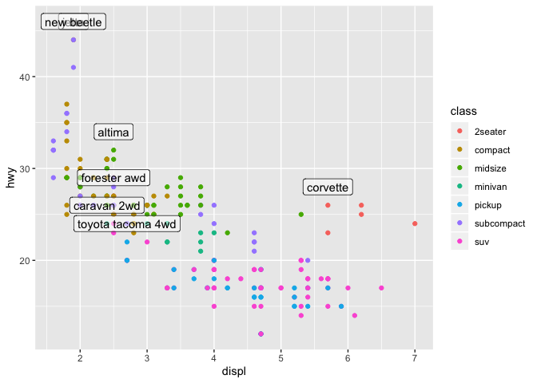
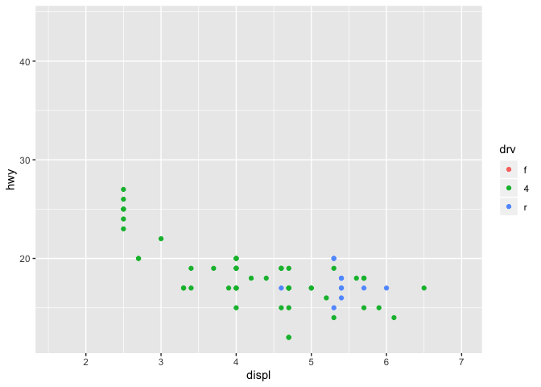

### Chapter 13: Relational Data

#### 13.1 Introduction    
- relations are between a pair of tables  
- mutating joins: add new variables to one data frame from matching observations in another  
- filtering joins: filter observations from one data frame based on whether or not they match an observation in the other table  
- set operations:treat observations as if they were set elements  

```r
library(tidyverse)
```

```
## ── Attaching packages ───────────────────────────────────────────────────────────────────────── tidyverse 1.2.1 ──
```

```
## ✔ ggplot2 3.2.0     ✔ purrr   0.3.2
## ✔ tibble  2.1.3     ✔ dplyr   0.8.1
## ✔ tidyr   0.8.3     ✔ stringr 1.4.0
## ✔ readr   1.3.1     ✔ forcats 0.4.0
```

```
## Warning: package 'ggplot2' was built under R version 3.5.2
```

```
## Warning: package 'tibble' was built under R version 3.5.2
```

```
## Warning: package 'tidyr' was built under R version 3.5.2
```

```
## Warning: package 'purrr' was built under R version 3.5.2
```

```
## Warning: package 'dplyr' was built under R version 3.5.2
```

```
## Warning: package 'stringr' was built under R version 3.5.2
```

```
## Warning: package 'forcats' was built under R version 3.5.2
```

```
## ── Conflicts ──────────────────────────────────────────────────────────────────────────── tidyverse_conflicts() ──
## ✖ dplyr::filter() masks stats::filter()
## ✖ dplyr::lag()    masks stats::lag()
```

```r
library(nycflights13)
```

#### 13.2: nycflights13  
Exercises  
1. Imagine you wanted to draw (approximately) the route each plane flies from its origin to its destination. What variables would you need? What tables would you need to combine?  
- You'd need the origin and the dest variables and would need to combine flights and airports.     
2. I forgot to draw the relationship between weather and airports. What is the relationship and how should it appear in the diagram?  
- airports connects to weather via the variable origin.   
3. weather only contains information for the origin (NYC) airports. If it contained weather records for all airports in the USA, what additional relation would it define with flights?   
- Maybe carrier or destination? I am unsure.   
4. We know that some days of the year are “special”, and fewer people than usual fly on them. How might you represent that data as a data frame? What would be the primary keys of that table? How would it connect to the existing tables?  
-  You could join flights with weather and then use the flight variable from flights to get a count of the number of flights for each day of the year. And then represent what you define as fewer people.   

#### 13.3: Keys  
- the variables used to connect the tables are known as keys   
- there are two types of keys:  
    - a primary key: uniquely identifies an observation in its own table  
    - a foreign key: uniquely identifies an observation in another table  
- one way to verify that a key does uniquely identify each observation is to count() the primary keys and look for entries where n is > 1  

```r
planes %>% 
  count(tailnum) %>% 
  filter(n > 1)
```

```
## # A tibble: 0 x 2
## # … with 2 variables: tailnum <chr>, n <int>
```
Exercises  
1. Add a surrogate key to flights

```r
flights6 <- flights %>%
  mutate(flight, 
         number = row_number(flight))
```

```r
flights6 %>% 
  count(number) %>% 
  filter(n > 1)
```

```
## # A tibble: 0 x 2
## # … with 2 variables: number <int>, n <int>
```
2.1 Lahman::Batting

```r
library(Lahman)
```

```
## Warning: package 'Lahman' was built under R version 3.5.2
```

```r
?Lahman
```
- player ID, year ID, team ID, league ID, stint  
2.2 babynames::babynames

```r
library("babynames")
```

```
## Warning: package 'babynames' was built under R version 3.5.2
```

```r
?babynames
```
- year, sex, name, n, and prop  

#### 13.4: Mutating joins 
- A mutating join allows you to combine variables from two tables  
- matches observations by their keys, then copies across variables from one table to the other  

```r
flights2 <- flights %>% 
  select(year:day, hour, origin, dest, tailnum, carrier)
```

```r
flights2
```

```
## # A tibble: 336,776 x 8
##     year month   day  hour origin dest  tailnum carrier
##    <int> <int> <int> <dbl> <chr>  <chr> <chr>   <chr>  
##  1  2013     1     1     5 EWR    IAH   N14228  UA     
##  2  2013     1     1     5 LGA    IAH   N24211  UA     
##  3  2013     1     1     5 JFK    MIA   N619AA  AA     
##  4  2013     1     1     5 JFK    BQN   N804JB  B6     
##  5  2013     1     1     6 LGA    ATL   N668DN  DL     
##  6  2013     1     1     5 EWR    ORD   N39463  UA     
##  7  2013     1     1     6 EWR    FLL   N516JB  B6     
##  8  2013     1     1     6 LGA    IAD   N829AS  EV     
##  9  2013     1     1     6 JFK    MCO   N593JB  B6     
## 10  2013     1     1     6 LGA    ORD   N3ALAA  AA     
## # … with 336,766 more rows
```
- you can combine two datasets with left_join()  

```r
flights2 %>%
  select(-origin, -dest) %>% 
  left_join(airlines, by = "carrier")
```

```
## # A tibble: 336,776 x 7
##     year month   day  hour tailnum carrier name                    
##    <int> <int> <int> <dbl> <chr>   <chr>   <chr>                   
##  1  2013     1     1     5 N14228  UA      United Air Lines Inc.   
##  2  2013     1     1     5 N24211  UA      United Air Lines Inc.   
##  3  2013     1     1     5 N619AA  AA      American Airlines Inc.  
##  4  2013     1     1     5 N804JB  B6      JetBlue Airways         
##  5  2013     1     1     6 N668DN  DL      Delta Air Lines Inc.    
##  6  2013     1     1     5 N39463  UA      United Air Lines Inc.   
##  7  2013     1     1     6 N516JB  B6      JetBlue Airways         
##  8  2013     1     1     6 N829AS  EV      ExpressJet Airlines Inc.
##  9  2013     1     1     6 N593JB  B6      JetBlue Airways         
## 10  2013     1     1     6 N3ALAA  AA      American Airlines Inc.  
## # … with 336,766 more rows
```
- you can get the same result with the mutate function:

```r
flights2 %>%
  select(-origin, -dest) %>% 
  mutate(name = airlines$name[match(carrier, airlines$carrier)])
```

```
## # A tibble: 336,776 x 7
##     year month   day  hour tailnum carrier name                    
##    <int> <int> <int> <dbl> <chr>   <chr>   <chr>                   
##  1  2013     1     1     5 N14228  UA      United Air Lines Inc.   
##  2  2013     1     1     5 N24211  UA      United Air Lines Inc.   
##  3  2013     1     1     5 N619AA  AA      American Airlines Inc.  
##  4  2013     1     1     5 N804JB  B6      JetBlue Airways         
##  5  2013     1     1     6 N668DN  DL      Delta Air Lines Inc.    
##  6  2013     1     1     5 N39463  UA      United Air Lines Inc.   
##  7  2013     1     1     6 N516JB  B6      JetBlue Airways         
##  8  2013     1     1     6 N829AS  EV      ExpressJet Airlines Inc.
##  9  2013     1     1     6 N593JB  B6      JetBlue Airways         
## 10  2013     1     1     6 N3ALAA  AA      American Airlines Inc.  
## # … with 336,766 more rows
```
- Inner joins: match pairs of observations whenever their keys are equal  
    - unmatched rows are not included in the output    
- Outer joins: keep observations that appear in at least one of the tables    
    - left join: keeps all observations in x    
    - right join: keeps all observations in y  
    - full join: keeps all observations in x and y  
- Duplicate keys: there are two possibilities when there are not unique keys  
1. One table has duplicate keys(useful for adding additional information as there is typically a one-to-many relationship)  

```r
x <- tribble(
  ~key, ~val_x,
     1, "x1",
     2, "x2",
     2, "x3",
     1, "x4"
)
y <- tribble(
  ~key, ~val_y,
     1, "y1",
     2, "y2"
)
left_join(x, y, by = "key")
```

```
## # A tibble: 4 x 3
##     key val_x val_y
##   <dbl> <chr> <chr>
## 1     1 x1    y1   
## 2     2 x2    y2   
## 3     2 x3    y2   
## 4     1 x4    y1
```
2. Both tables have duplicate keys (results in all possible combinations)

```r
x <- tribble(
  ~key, ~val_x,
     1, "x1",
     2, "x2",
     2, "x3",
     3, "x4"
)
y <- tribble(
  ~key, ~val_y,
     1, "y1",
     2, "y2",
     2, "y3",
     3, "y4"
)
left_join(x, y, by = "key")
```

```
## # A tibble: 6 x 3
##     key val_x val_y
##   <dbl> <chr> <chr>
## 1     1 x1    y1   
## 2     2 x2    y2   
## 3     2 x2    y3   
## 4     2 x3    y2   
## 5     2 x3    y3   
## 6     3 x4    y4
```
- Defining the key columns  
    - by = NULL uses all variables that appear in both tables (natural join)
    - by = c("a" = "b"): matches variable a in table x to variable b in table y; the variables from x will be used in the output    
Exercises  
1. Compute the average delay by destination, then join on the airports data frame so you can show the spatial distribution of delays. Here’s an easy way to draw a map of the United States:
- I can't figure out how to do this one. I thought I was able to get it using this datatable I had called delays, but I don't know where it came from and R doesn't accept it when I knit.  
2. Add the location of the origin and destination (i.e. the lat and lon) to flights


```r
flights2 %>% 
  left_join(airports, c("dest" = "faa"))  %>% 
  left_join(airports, c("origin" = "faa"))
```

```
## # A tibble: 336,776 x 22
##     year month   day  hour origin dest  tailnum carrier name.x lat.x lon.x
##    <int> <int> <int> <dbl> <chr>  <chr> <chr>   <chr>   <chr>  <dbl> <dbl>
##  1  2013     1     1     5 EWR    IAH   N14228  UA      Georg…  30.0 -95.3
##  2  2013     1     1     5 LGA    IAH   N24211  UA      Georg…  30.0 -95.3
##  3  2013     1     1     5 JFK    MIA   N619AA  AA      Miami…  25.8 -80.3
##  4  2013     1     1     5 JFK    BQN   N804JB  B6      <NA>    NA    NA  
##  5  2013     1     1     6 LGA    ATL   N668DN  DL      Harts…  33.6 -84.4
##  6  2013     1     1     5 EWR    ORD   N39463  UA      Chica…  42.0 -87.9
##  7  2013     1     1     6 EWR    FLL   N516JB  B6      Fort …  26.1 -80.2
##  8  2013     1     1     6 LGA    IAD   N829AS  EV      Washi…  38.9 -77.5
##  9  2013     1     1     6 JFK    MCO   N593JB  B6      Orlan…  28.4 -81.3
## 10  2013     1     1     6 LGA    ORD   N3ALAA  AA      Chica…  42.0 -87.9
## # … with 336,766 more rows, and 11 more variables: alt.x <int>,
## #   tz.x <dbl>, dst.x <chr>, tzone.x <chr>, name.y <chr>, lat.y <dbl>,
## #   lon.y <dbl>, alt.y <int>, tz.y <dbl>, dst.y <chr>, tzone.y <chr>
```

#### 13.5: Filtering Joins
- Filtering joins match observations in the same way as mutating joins, but affects observations not variables  
- semi_join(x, y) keeps all observations in x that have a match in y  
    -  useful for matching filtered summary tables back to the original rows  
- anti_join(x, y) drops all observations in x that have a match in y  
    - useful for diagnosing join mismatches  
Exercises   
2. Filter flights to only show flights with planes that have flown at least 100 flights.

```r
flights %>%
  semi_join(planes, by = "tailnum") %>%
  count(flight) %>%
  filter(n>100)
```

```
## # A tibble: 944 x 2
##    flight     n
##     <int> <int>
##  1      1   697
##  2      3   624
##  3      4   393
##  4      5   319
##  5      6   210
##  6      7   237
##  7      8   232
##  8      9   152
##  9     11   538
## 10     12   128
## # … with 934 more rows
```
4. Find the 48 hours (over the course of the whole year) that have the worst delays. Cross-reference it with the weather data. Can you see any patterns?

```r
arrange(flights, year, month, day, desc(dep_delay))
```

```
## # A tibble: 336,776 x 19
##     year month   day dep_time sched_dep_time dep_delay arr_time
##    <int> <int> <int>    <int>          <int>     <dbl>    <int>
##  1  2013     1     1      848           1835       853     1001
##  2  2013     1     1     2343           1724       379      314
##  3  2013     1     1     1815           1325       290     2120
##  4  2013     1     1     2205           1720       285       46
##  5  2013     1     1     1842           1422       260     1958
##  6  2013     1     1     2115           1700       255     2330
##  7  2013     1     1     2006           1630       216     2230
##  8  2013     1     1     2312           2000       192       21
##  9  2013     1     1     1942           1705       157     2124
## 10  2013     1     1     1938           1703       155     2109
## # … with 336,766 more rows, and 12 more variables: sched_arr_time <int>,
## #   arr_delay <dbl>, carrier <chr>, flight <int>, tailnum <chr>,
## #   origin <chr>, dest <chr>, air_time <dbl>, distance <dbl>, hour <dbl>,
## #   minute <dbl>, time_hour <dttm>
```
- I can't figure this one out for the life of me. I don't know how to find that specific 48 hours. Or how to group by 48 hours.

#### 13.6: Joining problems
- Procedure for ensuring your joins go properly  
      - Start by identifying the variables that form the primary key in each table  
      - Check that none of the variables in the primary key are missing (a missing value can't be an identifier)  
      - Check that your foreign keys match primary keys in another table (use anti_join())  

#### 13.7: Set operations  
- these operations work with a complete row, comparing the values of every variable  
- these operations treat tables like sets and expect x and y to have the same variables   
- intersect(x, y): return only observations in both x and y  
- union(x, y): return unique observations in x and y  
- setdiff(x, y): return observations in x, but not in y  

### Chapter 28: Graphics for Communication  

#### 28.1: Intro  

```r
library(tidyverse)
```

```r
library(ggplot2)
```

```r
library(ggrepel)
```

```
## Warning: package 'ggrepel' was built under R version 3.5.2
```

```r
library(viridis)
```

```
## Loading required package: viridisLite
```
#### 28.2: Label  
- you can add labels using the labs() function  

```r
ggplot(mpg, aes(displ, hwy)) +
  geom_point(aes(color = class)) +
  geom_smooth(se = FALSE) +
  labs(title = "Fuel efficiency generally decreases with engine size")
```

```
## `geom_smooth()` using method = 'loess' and formula 'y ~ x'
```

<!-- -->

- additional labels can be added with the subtitle and caption arguments  
    - subtitle:  adds additional detail in a smaller font beneath the title  
    - caption: adds text at the bottom right of the plot, often used to describe the source of the data  

```r
ggplot(mpg, aes(displ, hwy)) +
  geom_point(aes(color = class)) +
  geom_smooth(se = FALSE) +
  labs(
    title = "Fuel efficiency generally decreases with engine size",
    subtitle = "Two seaters (sports cars) are an exception because of their light weight",
    caption = "Data from fueleconomy.gov"
  )
```

```
## `geom_smooth()` using method = 'loess' and formula 'y ~ x'
```

<!-- -->

- you can also use labs() to alter axis and legend titles   

```r
ggplot(mpg, aes(displ, hwy)) +
  geom_point(aes(colour = class)) +
  geom_smooth(se = FALSE) +
  labs(
    x = "Engine displacement (L)",
    y = "Highway fuel economy (mpg)",
    colour = "Car type"
  )
```

```
## `geom_smooth()` using method = 'loess' and formula 'y ~ x'
```

<!-- -->

- you can switch "" with quote() in order to include equations 

```r
df <- tibble(
  x = runif(10),
  y = runif(10)
)
ggplot(df, aes(x, y)) +
  geom_point() +
  labs(
    x = quote(sum(x[i] ^ 2, i == 1, n)),
    y = quote(alpha + beta + frac(delta, theta))
  )
```

<!-- -->

Exercises  
1. Create one plot on the fuel economy data with customised title, subtitle, caption, x, y, and colour labels.  

```r
ggplot(mpg, aes(displ, hwy)) +
  geom_point(aes(colour = class)) +
  geom_smooth(se = FALSE) +
  labs(
    x = "Engine displacement (L)",
    y = "Highway fuel economy (mpg)",
    colour = "Car type",
     title = "Fuel efficiency generally decreases with engine size",
    subtitle = "Two seaters (sports cars) are an exception because of their light weight",
    caption = "Data from fueleconomy.gov"
  )
```

```
## `geom_smooth()` using method = 'loess' and formula 'y ~ x'
```

<!-- -->

#### 28.3 Annotations   
- you can label your observations with geom_text, its aesthetic label allows you to add textual labels to your plots  
- Tibble-based labelling:  

```r
best_in_class <- mpg %>%
  group_by(class) %>%
  filter(row_number(desc(hwy)) == 1)

ggplot(mpg, aes(displ, hwy)) +
  geom_point(aes(colour = class)) +
  geom_text(aes(label = model), data = best_in_class)
```

<!-- -->

- to clean up the plot from above, use geom_label(places text in a rectangular box) and nudge_y(moves label slightly above the point: 

```r
ggplot(mpg, aes(displ, hwy)) +
  geom_point(aes(colour = class)) +
  geom_label(aes(label = model), data = best_in_class, nudge_y = 2, alpha = 0.5)
```

<!-- -->

- to fix the overlap that occurs with the labels, use ggrepel:  

```r
ggplot(mpg, aes(displ, hwy)) +
  geom_point(aes(colour = class)) +
  geom_point(size = 3, shape = 1, data = best_in_class) +
  ggrepel::geom_label_repel(aes(label = model), data = best_in_class)
```

<!-- -->

- you can also remove the legend and move the labels onto the plot:  

```r
class_avg <- mpg %>%
  group_by(class) %>%
  summarise(
    displ = median(displ),
    hwy = median(hwy)
  )

ggplot(mpg, aes(displ, hwy, colour = class)) +
  ggrepel::geom_label_repel(aes(label = class),
    data = class_avg,
    size = 6,
    label.size = 0,
    segment.color = NA
  ) +
  geom_point() +
  theme(legend.position = "none")
```

<!-- -->

- other geoms:  
    -  geom_hline() and geom_vline(): add reference lines  
    -  geom_rect(): draws a rectangle around points of interest(boundaries of the rectangle are defined by aesthetics xmin, xmax, ymin, ymax)  
    -  geom_segment() with the arrow argument:draws attention to a point with an arrow; aesthetics x and y  define the starting location and xend and yend  define the end location  

#### 28.4: Scales  
- breaks and labels are what affect the ticks on the axes and the keys on the legend  
- breaks control the positions of the ticks and the values associated with the keys  
- labels control the text label associated with each tick/key  
- breaks are typically used to override the default choice  

```r
ggplot(mpg, aes(displ, hwy)) +
  geom_point() +
  scale_y_continuous(breaks = seq(15, 40, by = 5))
```

<!-- -->

- when you set labels = NULL, it removes all the labels

```r
ggplot(mpg, aes(displ, hwy)) +
  geom_point() +
  scale_x_continuous(labels = NULL) +
  scale_y_continuous(labels = NULL)
```

<!-- -->

- you can use theme() and the legend.position argument to change the layout of the legend:   

```r
base <- ggplot(mpg, aes(displ, hwy)) +
  geom_point(aes(colour = class))

base + theme(legend.position = "left")
```

<!-- -->

```r
base + theme(legend.position = "top")
```

<!-- -->

```r
base + theme(legend.position = "bottom")
```

<!-- -->

```r
base + theme(legend.position = "right") 
```

<!-- -->

- you can also use guides() and guide_legend() to control the display of indiviudal legends:  

```r
ggplot(mpg, aes(displ, hwy)) +
  geom_point(aes(colour = class)) +
  geom_smooth(se = FALSE) +
  theme(legend.position = "bottom") +
  guides(colour = guide_legend(nrow = 1, override.aes = list(size = 4)))
```

```
## `geom_smooth()` using method = 'loess' and formula 'y ~ x'
```

<!-- -->

- the scale_x_log10 and scale_y_log10 can be used to transform the shape of the data without complicating the naming or any other factors  

```r
ggplot(diamonds, aes(carat, price)) +
  geom_bin2d() + 
  scale_x_log10() + 
  scale_y_log10()
```

<!-- -->

- functions for changing the colors of a plot:  
    - scale_colour_brewer() with the palette = argument sets the colors as a pretermined set of colors  
    - scale_colour_manual() allows you to set the color values manually   
    - scale_colour_gradient(): can be used for continuous color
    - scale_colour_viridis(): a continuous analog of the categorical colorbrewer scales  

```r
library("hexbin")
```

```
## Warning: package 'hexbin' was built under R version 3.5.2
```

```r
df <- tibble(
  x = rnorm(10000),
  y = rnorm(10000)
)
ggplot(df, aes(x, y)) +
  geom_hex() +
  coord_fixed()
```

<!-- -->

```r
ggplot(df, aes(x, y)) +
  geom_hex() +
  viridis::scale_fill_viridis() +
  coord_fixed()
```

<!-- -->

Exercises  
1. Why doesn’t the following code override the default scale?

```r
ggplot(df, aes(x, y)) +
  geom_hex() +
  scale_colour_gradient(low = "white", high = "red", guide = "colourbar", aesthetics = c("colour", "fill")) +
  coord_fixed()
```

<!-- -->

```r
?scale_color_gradient
```
- it was missing the aesthetics argument to assign it to both colours and fill.   
4. Use override.aes to make the legend on the following plot easier to see.

```r
ggplot(diamonds, aes(carat, price)) +
  geom_point(aes(colour = cut,), alpha = 1/20)+
    theme(legend.position = "bottom") +
  guides(colour = guide_legend(nrow = 1, override.aes = list(size = 10)))
```

<!-- -->


#### 28.5: Zooming  
- there are 3 ways to control the plot limits  
1. Adjusting what data are plotted  
2. Setting the limits in each scale  
3. Setting xlim and ylim in coord_cartesian()  
- it's generally best to use coord_cartesian():  

```r
ggplot(mpg, mapping = aes(displ, hwy)) +
  geom_point(aes(color = class)) +
  geom_smooth() +
  coord_cartesian(xlim = c(5, 7), ylim = c(10, 30))
```

```
## `geom_smooth()` using method = 'loess' and formula 'y ~ x'
```

<!-- -->

- here is how you can keep scales consistent across many plots by using limits  

```r
suv <- mpg %>% filter(class == "suv")
compact <- mpg %>% filter(class == "compact")
x_scale <- scale_x_continuous(limits = range(mpg$displ))
y_scale <- scale_y_continuous(limits = range(mpg$hwy))
col_scale <- scale_colour_discrete(limits = unique(mpg$drv))

ggplot(suv, aes(displ, hwy, colour = drv)) +
  geom_point() +
  x_scale +
  y_scale +
  col_scale
```

<!-- -->

```r
ggplot(compact, aes(displ, hwy, colour = drv)) +
  geom_point() +
  x_scale +
  y_scale +
  col_scale
```

<!-- -->

#### 28.6: Themes  
- you can customize non-elements of your plot with themes  
    - theme_bw(): white background with gridlines  
    - theme_classic(): axes but no gridlines  
    - theme_dark(): dark background for contrast  
    - theme_gray(): gray background  
    - theme_light(): light axes and gridlines  
    - theme_linedraw(): only black lines    
    - theme_minimal(): no background  
    - theme_void(): only geoms are visible   

#### 28.7: Saving your plots  
- ggsave() will save your most recent plot to disk  
- figuresizing:  
    - fig.width
    - fig.height 
    - fig.asp
    - out.width  
    - out.height
    - (fig refers to the size of the figure while, out refers to the size of the output document)  


